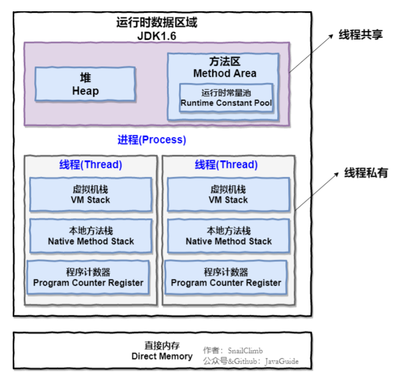
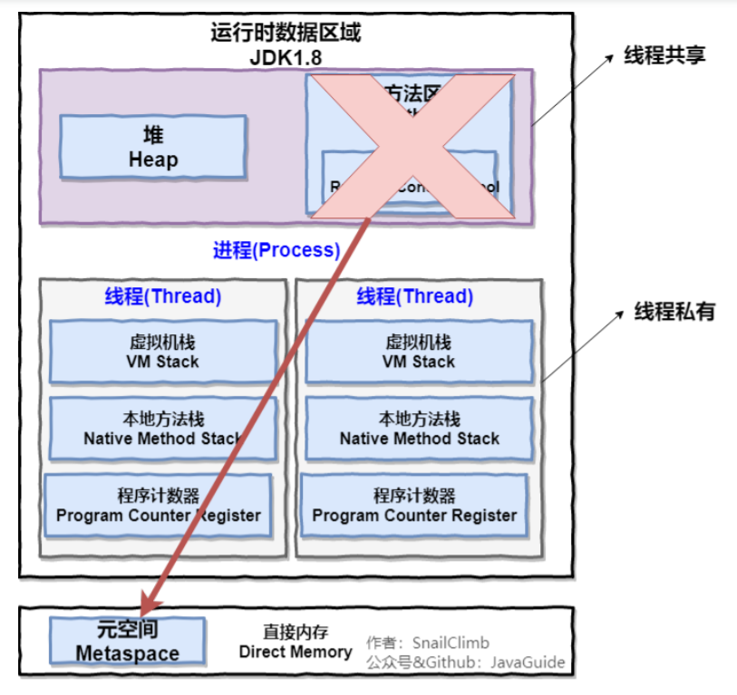
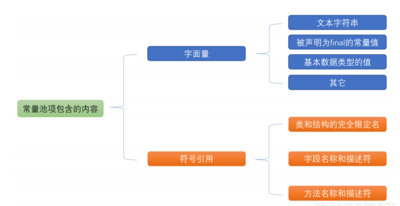

# 骨干

##线程私有部分

程序计数器\Java虚拟机栈\本地方法栈

## 线程共享部分

堆\方法区\直接内存

###程序计数器

当前线程所执⾏的字节码的⾏号指示器,是唯一没有OOM的地方

有两个作用:

(1)字节码解释器通过改变程序计数器来依次读取指令，从⽽实现代码的流程控制,如：顺序执⾏、 选择、循环、异常处理。 

(2)在多线程的情况下，程序计数器⽤于记录当前线程执⾏的位置，从⽽当线程被切换回来的时候能 够知道该线程上次运⾏到哪⼉了。 

###Java 虚拟机栈

Java虚拟机栈是由⼀个个栈帧组成，方法的调用与退出就是栈帧的压栈与弹栈,⽽每个栈帧中都拥有：局部变量表、操作数栈、动态链接、⽅法出⼝信息。

Java 虚拟机栈会出现两种异常：StackOverFlowError 和 OutOfMemoryError。 

StackOverFlowError： 若Java虚拟机栈的内存⼤⼩不允许动态扩展，那么当线程请求栈的深度 超过当前Java虚拟机栈的最⼤深度的时候，就抛出StackOverFlowError异常。最常见的就是无出口的递归.

 OutOfMemoryError： 若 Java 虚拟机栈的内存⼤⼩允许动态扩展，且当线程请求栈时内存⽤完 了，⽆法再动态扩展了，此时抛出OutOfMemoryError异常。

### 本地⽅法栈

和虚拟机栈相似,只不过调用的是Native方法

### 堆

Java 虚拟机所管理的内存中最⼤的⼀块，Java 堆是所有线程共享的⼀块内存区域，在虚拟机启动时创 建。此内存区域的唯⼀⽬的就是==存放对象实例，⼏乎所有的对象实例以及数组==都在这⾥分配内存。

所以Java堆还可以细分为：新⽣代和⽼年代：再 细致⼀点有：Eden空间、From Survivor、To Survivor空间等。进⼀步划分的⽬的是更好地回收内存， 或者更快地分配内存。

###方法区

它⽤于存储已被虚拟机加载的类信息、常量、静 态变量、即时编译器编译后的代码等数据。

为什么要将永久代(PermGen)替换为元空间(MetaSpace)呢? 

元空间不再受虚拟机限制,而受本机 可⽤内存的限制,不容易报OOM

运⾏时常量池 

运⾏时常量池是⽅法区的⼀部分。Class ⽂件中除了有类的版本、字段、⽅法、接⼝等描述信息外，还 有常量池信息（⽤于存放编译期⽣成的各种字⾯量和符号引⽤） 

### 直接内存

在JDK1.4引入NIO的概念,使用的就是直接内存,由于NIO避免了在 Java 堆和 Native 堆之间来回复制数据。 所以性能高效.

# ------------------------------------

1.7及之前

1.8及之后

线程私有的： 程序计数器 虚拟机栈 本地⽅法栈 

线程共享的： 堆 ⽅法区 直接内存(⾮运⾏时数据区的⼀部分) 

###程序计数器 

程序计数器是⼀块⼩的内存空间，可以看作是当前线程所执⾏的字节码的⾏号指示器。字节码解释器 ⼯作时通过改变这个计数器的值来选取下⼀条需要执⾏的字节码指令，分⽀、循环、跳转、异常处理、 线程恢复等功能都需要依赖这个计数器来完。 

另外，为了线程切换后能恢复到正确的执⾏位置，每条线程都需要有⼀个独⽴的程序计数器，各线程之 间计数器互不影响，独⽴存储，我们称这类内存区域为“线程私有”的内存。 

从上⾯的介绍中我们知道程序计数器主要有两个作⽤：

  1. 字节码解释器通过改变程序计数器来依次读取指令，从⽽实现代码的流程控制，如：顺序执⾏、 选择、循环、异常处理。 
  2. 在多线程的情况下，程序计数器⽤于记录当前线程执⾏的位置，从⽽当线程被切换回来的时候能 够知道该线程上次运⾏到哪⼉了。 
  3. 注意：程序计数器是唯⼀⼀个不会出现 OutOfMemoryError 的内存区域，它的⽣命周期随着线程的创建 ⽽创建，随着线程的结束⽽死亡。 
### Java 虚拟机栈 

与程序计数器⼀样，Java虚拟机栈也是线程私有的，它的⽣命周期和线程相同，描述的是 Java ⽅法执 ⾏的内存模型，每次⽅法调⽤的数据都是通过栈传递的。

 Java 内存可以粗糙的区分为堆内存（Heap）和栈内存(Stack),其中栈就是现在说的虚拟机栈，或者说 是虚拟机栈中局部变量表部分。 （实际上，Java虚拟机栈是由⼀个个栈帧组成，⽽每个栈帧中都拥 有：局部变量表、操作数栈、动态链接、⽅法出⼝信息。） 

局部变量表主要存放了编译器可知的各种数据类型（boolean、byte、char、short、int、float、 long、double）、对象引⽤（reference类型，它不同于对象本身，可能是⼀个指向对象起始地址的引 ⽤指针，也可能是指向⼀个代表对象的句柄或其他与此对象相关的位置）。 

Java 虚拟机栈会出现两种异常：StackOverFlowError 和 OutOfMemoryError。 

StackOverFlowError： 若Java虚拟机栈的内存⼤⼩不允许动态扩展，那么当线程请求栈的深度 超过当前Java虚拟机栈的最⼤深度的时候，就抛出StackOverFlowError异常。

 OutOfMemoryError： 若 Java 虚拟机栈的内存⼤⼩允许动态扩展，且当线程请求栈时内存⽤完 了，⽆法再动态扩展了，此时抛出OutOfMemoryError异常。

 Java 虚拟机栈也是线程私有的，每个线程都有各⾃的Java虚拟机栈，⽽且随着线程的创建⽽创建，随 着线程的死亡⽽死亡。 

扩展：那么⽅法/函数如何调⽤？

 Java 栈可⽤类⽐数据结构中栈，Java 栈中保存的主要内容是栈帧，每⼀次函数调⽤都会有⼀个对应的 栈帧被压⼊Java栈，每⼀个函数调⽤结束后，都会有⼀个栈帧被弹出。 

Java⽅法有两种返回⽅式： 1. return 语句。 2. 抛出异常。 

不管哪种返回⽅式都会导致栈帧被弹出。 

### 本地⽅法栈 

和虚拟机栈所发挥的作⽤⾮常相似，区别是： 虚拟机栈为虚拟机执⾏ Java ⽅法 （也就是字节码）服 务，⽽本地⽅法栈则为虚拟机使⽤到的 Native ⽅法服务。 在 HotSpot 虚拟机中和 Java 虚拟机栈合 ⼆为⼀。

 本地⽅法被执⾏的时候，在本地⽅法栈也会创建⼀个栈帧，⽤于存放该本地⽅法的局部变量表、操作数 栈、动态链接、出⼝信息。 

⽅法执⾏完毕后相应的栈帧也会出栈并释放内存空间，也会出现 StackOverFlowError 和 OutOfMemoryError 两种异常。 

### 堆 

Java 虚拟机所管理的内存中最⼤的⼀块，Java 堆是所有线程共享的⼀块内存区域，在虚拟机启动时创 建。此内存区域的唯⼀⽬的就是存放对象实例，⼏乎所有的对象实例以及数组都在这⾥分配内存。

 Java 堆是垃圾收集器管理的主要区域，因此也被称作GC堆（Garbage Collected Heap）.从垃圾回收的 ⻆度，由于现在收集器基本都采⽤分代垃圾收集算法，所以Java堆还可以细分为：新⽣代和⽼年代：再 细致⼀点有：Eden空间、From Survivor、To Survivor空间等。进⼀步划分的⽬的是更好地回收内存， 或者更快地分配内存。

 上图所示的 eden区、s0区、s1区都属于新⽣代，tentired 区属于⽼年代。⼤部分情况，对象都会⾸先 在 Eden 区域分配，在⼀次新⽣代垃圾回收后，如果对象还存活，则会进⼊ s0 或者 s1，并且对象的 年龄还会加 1(Eden区i>Survivor 区后对象的初始年龄变为1)，当它的年龄增加到⼀定程度（默认为15 岁），就会被晋升到⽼年代中。对象晋升到⽼年代的年龄阈值，可以通过参数 - XX:MaxTenuringThreshold 来设置。 

### ⽅法区 

⽅法区与 Java 堆⼀样，是各个线程共享的内存区域，它⽤于存储已被虚拟机加载的类信息、常量、静 态变量、即时编译器编译后的代码等数据。虽然Java虚拟机规范把⽅法区描述为堆的⼀个逻辑部分，但 是它却有⼀个别名叫做 Non-Heap（⾮堆），⽬的应该是与 Java 堆区分开来。

可以设置永久代或元空间的初始⼤⼩    和最⼤⼤⼩ 

为什么要将永久代(PermGen)替换为元空间(MetaSpace)呢? 

整个永久代有⼀个 JVM 本身设置固定⼤⼩上线，⽆法进⾏调整，⽽元空间使⽤的是直接内存，受本机 可⽤内存的限制，并且永远不会得到java.lang.OutOfMemoryError。你可以使⽤ -XX： MaxMetaspaceSize 标志设置最⼤元空间⼤⼩，默认值为 unlimited，这意味着它只受系统内存的限 制。 -XX：MetaspaceSize 调整标志定义元空间的初始⼤⼩如果未指定此标志，则 Metaspace 将根 据运⾏时的应⽤程序需求动态地重新调整⼤⼩。 当然这只是其中⼀个原因，还有很多底层的原因，这⾥就不提了。 

运⾏时常量池 

运⾏时常量池是⽅法区的⼀部分。Class ⽂件中除了有类的版本、字段、⽅法、接⼝等描述信息外，还 有常量池信息（⽤于存放编译期⽣成的各种字⾯量和符号引⽤） 

既然运⾏时常量池时⽅法区的⼀部分，⾃然受到⽅法区内存的限制，当常量池⽆法再申请到内存时会抛 出 OutOfMemoryError 异常。 

### 直接内存 

直接内存并不是虚拟机运⾏时数据区的⼀部分，也不是虚拟机规范中定义的内存区域，但是这部分内存 也被频繁地使⽤。⽽且也可能导致 OutOfMemoryError 异常出现。 

JDK1.4 中新加⼊的 NIO(New Input/Output) 类，引⼊了⼀种基于通道（Channel） 与缓存区 （Buffer） 的 I/O ⽅式，它可以直接使⽤ Native 函数库直接分配堆外内存，然后通过⼀个存储在 Java 堆中的 DirectByteBuffer 对象作为这块内存的引⽤进⾏操作。这样就能在⼀些场景中显著提⾼ 性能，因为避免了在 Java 堆和 Native 堆之间来回复制数据。 

本机直接内存的分配不会收到 Java 堆的限制，但是，既然是内存就会受到本机总内存⼤⼩以及处理器 寻址空间的限制。 