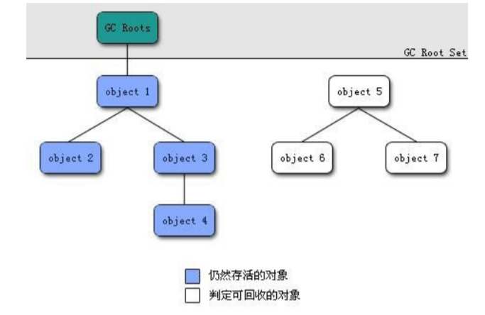

# 骨干

### 引⽤计数法

给对象中添加⼀个引⽤计数器，每当有⼀个地⽅引⽤它，计数器就加1；当引⽤失效，计数器就减1；任 何时候计数器为0的对象就是不可能再被使⽤的。 如果出现循环引用情况,则会造成对象不被回收,内存泄漏

### 可达性分析算法  

这个算法的基本思想就是通过⼀系列的称为 “GC Roots” (VM栈中引用\方法区中的静态引用\JNI中的引用)的对象作为起点，从这些节点开始向下搜索， 节点所⾛过的路径称为引⽤链，当⼀个对象到 GC Roots 没有任何引⽤链相连的话，则证明此对象是不 可⽤的。 

