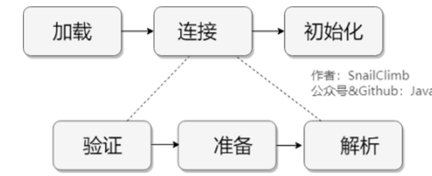

类加载过程：加载->连接->初始化。连接过程⼜可分为三步:验证->准备->解析。 

## 加载

这个阶段会在内存中生成一个代表这个类的 java.lang.Class 对 象，作为方法区这个类的各种数据的入口 

## 验证

确保 Class 文件的字节流中包含的信息是否符合当前虚拟机的要求 

## 准备

正式为类变量分配内存并设置类变量的初始值阶段，即在方法区中分配这些变量所使 用的内存空间。 

## 解析

虚拟机将常量池中的符号引用替换为直接引用的过程 

## 初始化

是执行<client>类构造器方法的过程 

