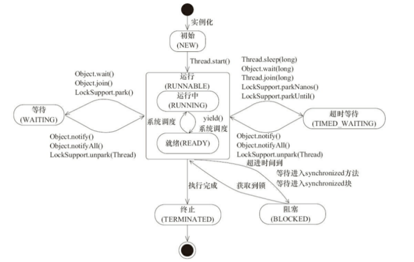

Java 线程在运⾏的⽣命周期中的指定时刻只可能处于下⾯ 6 种不同状态的其中⼀个状态 

线程在⽣命周期中并不是固定处于某⼀个状态⽽是随着代码的执⾏在不同状态之间切换。Java 线程状 态变迁如下图所示 

由上图可以看出：线程创建之后它将处于 NEW（新建） 状态，调⽤ start() ⽅法后开始运⾏，线程 这时候处于 READY（可运⾏） 状态。可运⾏状态的线程获得了 CPU 时间⽚（timeslice）后就处于 RUNNING（运⾏） 状态。 

当线程执⾏ wait() ⽅法之后，线程进⼊ WAITING（等待） 状态。进⼊等待状态的线程需要依靠其他 线程的通知才能够返回到运⾏状态，⽽ TIME_WAITING(超时等待) 状态相当于在等待状态的基础上增加 了超时限制，⽐如通过 sleep（long millis） ⽅法或 wait（long millis） ⽅法可以将 Java 线程置于 TIMED WAITING 状态。当超时时间到达后 Java 线程将会返回到 RUNNABLE 状态。当线程调 ⽤同步⽅法时，在没有获取到锁的情况下，线程将会进⼊到 BLOCKED（阻塞） 状态。线程在执⾏ Runnable 的 run() ⽅法之后将会进⼊到 TERMINATED（终⽌） 状态。 