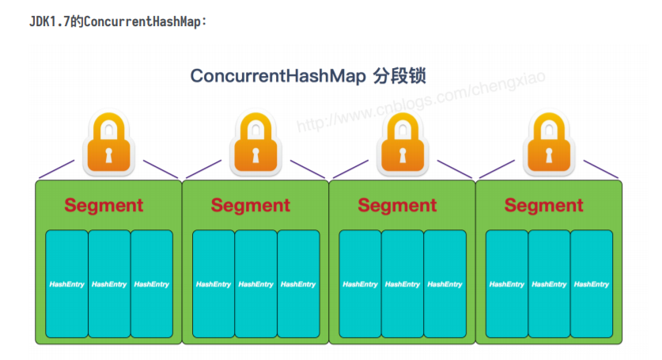
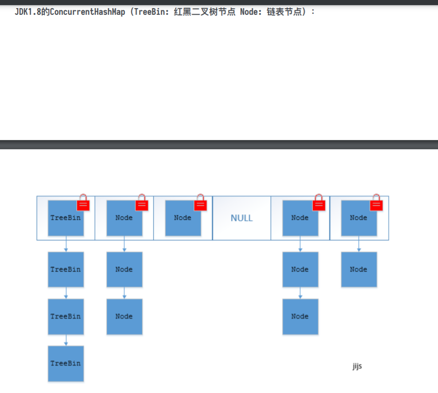

# 骨干

##JDK1.7

⾸先将数据分为⼀段⼀段的存储，然后给每⼀段数据配⼀把锁，当⼀个线程占⽤锁访问其中⼀个段数据 时，其他段的数据也能被其他线程访问。 ConcurrentHashMap 是由 Segment 数组结构和 HashEntry 数组结构组成。 Segment 实现了 ReentrantLock,所以 Segment 是⼀种可重⼊锁，扮演锁的⻆⾊。HashEntry ⽤于存储 键值对数据。 ⼀个 ConcurrentHashMap ⾥包含⼀个 Segment 数组。Segment 的结构和HashMap类似，是⼀种数组和 链表结构，⼀个 Segment 包含⼀个 HashEntry 数组，每个 HashEntry 是⼀个链表结构的元素，每个 Segment 守护着⼀个HashEntry数组⾥的元素，当对 HashEntry 数组的数据进⾏修改时，必须⾸先获得 对应的 Segment的锁。 

##JDK1.8

ConcurrentHashMap取消了Segment分段锁，采⽤CAS和synchronized来保证并发安全。数据结构跟 HashMap1.8的结构类似，数组+链表/红⿊⼆叉树。Java 8在链表⻓度超过⼀定阈值（8）时将链表（寻 址时间复杂度为O(N)）转换为红⿊树（寻址时间复杂度为O(log(N))） synchronized只锁定当前链表或红⿊⼆叉树的⾸节点，这样只要hash不冲突，就不会产⽣并发，效率⼜ 提升N倍。

# ----------------------------------

JDK1.7（上⾯有示意图） ⾸先将数据分为⼀段⼀段的存储，然后给每⼀段数据配⼀把锁，当⼀个线程占⽤锁访问其中⼀个段数据 时，其他段的数据也能被其他线程访问。 ConcurrentHashMap 是由 Segment 数组结构和 HashEntry 数组结构组成。 Segment 实现了 ReentrantLock,所以 Segment 是⼀种可重⼊锁，扮演锁的⻆⾊。HashEntry ⽤于存储 键值对数据。 ⼀个 ConcurrentHashMap ⾥包含⼀个 Segment 数组。Segment 的结构和HashMap类似，是⼀种数组和 链表结构，⼀个 Segment 包含⼀个 HashEntry 数组，每个 HashEntry 是⼀个链表结构的元素，每个 Segment 守护着⼀个HashEntry数组⾥的元素，当对 HashEntry 数组的数据进⾏修改时，必须⾸先获得 对应的 Segment的锁。 

JDK1.8 （上⾯有示意图） ConcurrentHashMap取消了Segment分段锁，采⽤CAS和synchronized来保证并发安全。数据结构跟 HashMap1.8的结构类似，数组+链表/红⿊⼆叉树。Java 8在链表⻓度超过⼀定阈值（8）时将链表（寻 址时间复杂度为O(N)）转换为红⿊树（寻址时间复杂度为O(log(N))） synchronized只锁定当前链表或红⿊⼆叉树的⾸节点，这样只要hash不冲突，就不会产⽣并发，效率⼜ 提升N倍。 