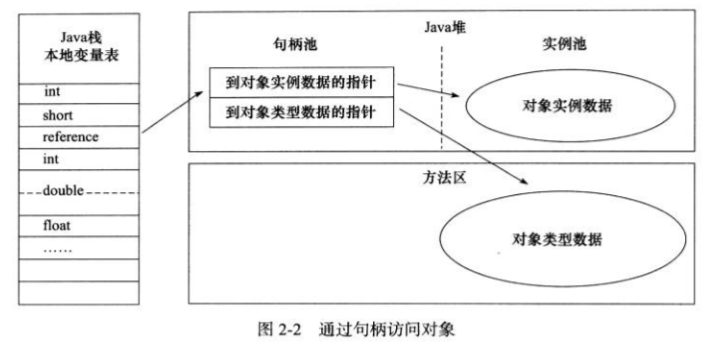
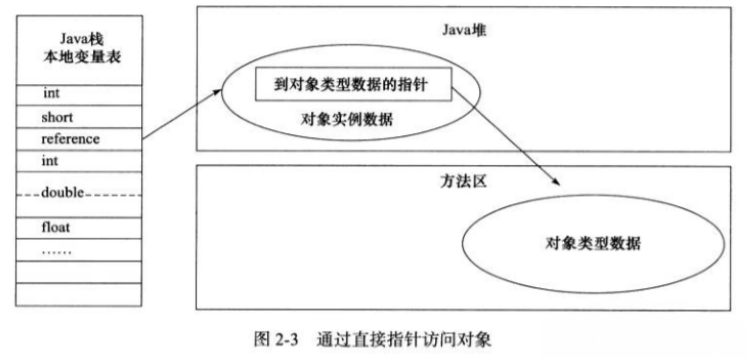

建⽴对象就是为了使⽤对象，我们的Java程序通过栈上的 reference 数据来操作堆上的具体对象。对 象的访问⽅式有虚拟机实现⽽定，⽬前主流的访问⽅式有①使⽤句柄和②直接指针两种： 

1. 句柄： 如果使⽤句柄的话，那么Java堆中将会划分出⼀块内存来作为句柄池，reference 中存 储的就是对象的句柄地址，⽽句柄中包含了对象实例数据与类型数据各⾃的具体地址信息； 

   

2. 直接指针： 如果使⽤直接指针访问，那么 Java 堆对象的布局中就必须考虑如何放置访问类型 数据的相关信息，⽽reference 中存储的直接就是对象的地址。 

   

   这两种对象访问⽅式各有优势。使⽤句柄来访问的最⼤好处是 reference 中存储的是稳定的句柄地 址，在对象被移动时只会改变句柄中的实例数据指针，⽽ reference 本身不需要修改。使⽤直接指针 访问⽅式最⼤的好处就是速度快，它节省了⼀次指针定位的时间开销。 