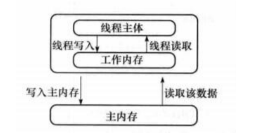
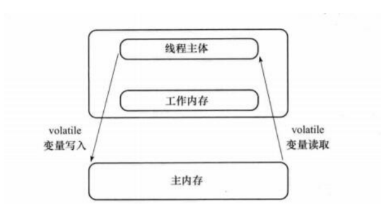

在 JDK1.2 之前，Java的内存模型实现总是从主存（即共享内存）读取变量，是不需要进⾏特别的注意 的。⽽在当前的 Java 内存模型下，线程可以把变量保存本地内存（⽐如机器的寄存器）中，⽽不是直 接在主存中进⾏读写。这就可能造成⼀个线程在主存中修改了⼀个变量的值，⽽另外⼀个线程还继续使 ⽤它在寄存器中的变量值的拷⻉，造成数据的不⼀致。 

要解决这个问题，就需要把变量声明为volatile，这就指示 JVM，这个变量是不稳定的，每次使⽤它都 到主存中进⾏读取。 说⽩了， volatile 关键字的主要作⽤就是保证变量的可⻅性然后还有⼀个作⽤是防⽌指令重排序。 

