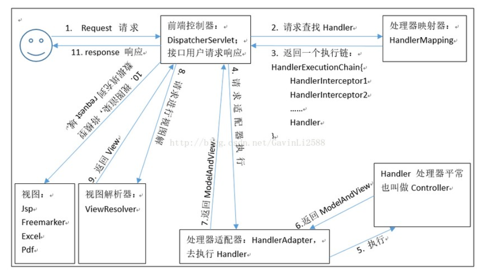

SpringMVC流程：
01、用户发送出请求到前端控制器DispatcherServlet。
02、DispatcherServlet收到请求调用HandlerMapping（处理器映射器）。
03、HandlerMapping找到具体的处理器(可查找xml配置或注解配置)，生成处理器对象及处理器
拦截器(如果有)，再一起返回给DispatcherServlet。
04、DispatcherServlet调用HandlerAdapter（处理器适配器）。
05、HandlerAdapter经过适配调用具体的处理器（Handler/Controller）。
06、Controller执行完成返回ModelAndView对象。
07、HandlerAdapter将Controller执行结果ModelAndView返回给DispatcherServlet。
08、DispatcherServlet将ModelAndView传给ViewReslover（视图解析器）。
09、ViewReslover解析后返回具体View（视图）。
10、DispatcherServlet根据View进行渲染视图（即将模型数据填充至视图中）。
11、DispatcherServlet响应用户。

