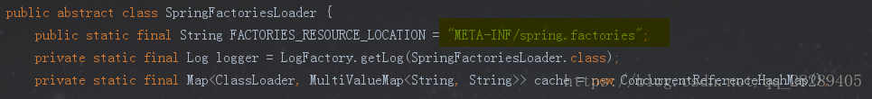
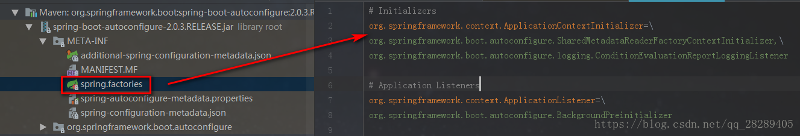

首先点击源码,该注解包含7个注解

3个重要的注解,4个标识性注解

##（一）、@ComponentScan 注解

1、@ComponentScan这个注解在Spring中很重要，它对应XML配置中的元素，@ComponentScan的功能其实就是自动扫描并加载符合条件的组件（比如@Component和@Repository等）或者bean定义，最终将这些bean定义加载到IoC容器中。

我们可以通过basePackages等属性来细粒度的定制@ComponentScan自动扫描的范围，如果不指定，则默认Spring框架实现会从声明@ComponentScan所在类的package进行扫描。

> 注：所以SpringBoot的启动类最好是放在root package下，因为默认不指定basePackages。

2、@ComponentScan告诉Spring 哪个packages 的用注解标识的类 会被spring自动扫描并且装入bean容器。

例如，如果你有个类用@Controller注解标识了，那么，如果不加上@ComponentScan，自动扫描该controller，那么该Controller就不会被spring扫描到，更不会装入spring容器中，因此你配置的这个Controller也没有意义。

## （二）、@EnableAutoConfiguration 注解

@EnableAutoConfiguration 简单概括一下就是，**借助@Import的支持，收集和注册特定场景相关的bean定义**。

- @EnableScheduling是通过@Import将Spring调度框架相关的bean定义都加载到IoC容器。
- @EnableMBeanExport是通过@Import将JMX相关的bean定义加载到IoC容器。

而@EnableAutoConfiguration也是借助@Import的帮助，将所有符合自动配置条件的bean定义加载到IoC容器，仅此而已！

其中，最关键的要属@Import(AutoConfigurationImportSelector.class)，借助AutoConfigurationImportSelector，@EnableAutoConfiguration可以帮助SpringBoot应用将所有符合条件的@Configuration配置都加载到当前SpringBoot创建并使用的IoC容器。 

**自动配置幕后英雄：SpringFactoriesLoader详解**        SpringFactoriesLoader属于Spring框架私有的一种扩展方案，其主要功能就是从指定的配置文件META-INF/spring.factories加载配置。 



 配合@EnableAutoConfiguration使用的话，它更多是提供一种配置查找的功能支持，即根据@EnableAutoConfiguration的完整类名org.springframework.boot.autoconfigure.EnableAutoConfiguration作为查找的Key,获取对应的一组@Configuration类 



上图就是从SpringBoot的autoconfigure依赖包中的META-INF/spring.factories配置文件中摘录的一段内容，可以很好地说明问题。

​        所以，@EnableAutoConfiguration自动配置的魔法骑士就变成了：**从classpath中搜寻所有的META-INF/spring.factories配置文件，并将其中org.springframework.boot.autoconfigure.EnableutoConfiguration对应的配置项通过反射（Java Refletion）实例化为对应的标注了@Configuration的JavaConfig形式的IoC容器配置类，然后汇总为一个并加载到IoC容器。**

## (三）、@SpringBootConfiguration 注解

```
@SpringBootConfiguration继承自@Configuration，二者功能也一致，标注当前类是配置类，

并会将当前类内声明的一个或多个以@Bean注解标记的方法的实例纳入到spring容器中，并且实例名就是方法名。
```

## （四）、@Inherited 注解

**关于java中元注解Inherited 的使用说明**

**首先解释下元注解，就是用来中声明注解类型时需要使用到的注解。**

Inherited作用是，使用此注解声明出来的自定义注解，在使用此自定义注解时，如果注解在类上面时，子类会自动继承此注解，否则的话，子类不会继承此注解。这里一定要记住，使用Inherited声明出来的注解，只有在类上使用时才会有效，对方法，属性等其他无效。

## (五）、@Documented 注解

​        Documented注解表明这个注释是由 javadoc记录的，在默认情况下也有类似的记录工具。 如果一个类型声明被注释了文档化，它的注释成为公共API的一部分。

## （六）、@Retention() 注解

RetentionPolicy这个枚举类型的常量描述保留注释的各种策略，它们与元注释(@Retention)一起指定注释要保留多长时间

## （七）、@Target()  注解

ElementType 这个枚举类型的常量提供了一个简单的分类：注释可能出现在Java程序中的语法位置（这些常量与元注释类型(@Target)一起指定在何处写入注释的合法位置）