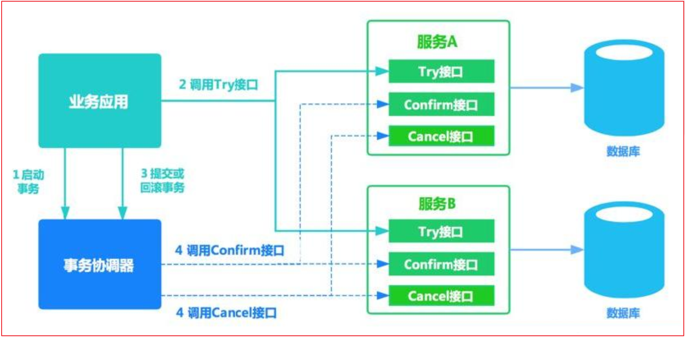
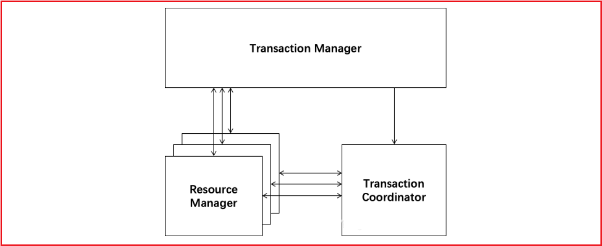

什么是分布式事务

分布式事务指事务的参与者、支持事务的服务器、资源服务器以及事务管理器分别位于不同的分布式系统的不同节点之上,且属于不同的应用，分布式事务需要保证这些操作要么全部成功，要么全部失败。本质上来说，分布式事务就是为了保证不同数据库的数据一致性。

## 2 分布式事务解决方案

1.XA两段提交(低效率)-21 XA JTA分布式事务解决方案

2.TCC三段提交(2段,高效率[不推荐(补偿代码)])

3.本地消息(MQ+Table)

4.事务消息(RocketMQ[alibaba])

5.Seata(alibaba)


### 2.1  基于XA协议的两阶段提交(2PC)

两阶段提交协议(Two Phase Commitment Protocol)中，涉及到两种角色

==一个事务协调者==（coordinator）：负责协调多个参与者进行事务投票及提交(回滚)
多个==事务参与者==（participants）：即本地事务执行者

总共处理步骤有两个
（1）投票阶段（voting phase）：协调者将通知事务参与者准备提交或取消事务，然后进入表决过程。参与者将告知协调者自己的决策：同意（事务参与者本地事务执行成功，但未提交）或取消（本地事务执行故障）；
（2）提交阶段（commit phase）：收到参与者的通知后，协调者再向参与者发出通知，根据反馈情况决定各参与者是否要提交还是回滚；

如果所示 1-2为第一阶段，2-3为第二阶段


如果任一资源管理器在第一阶段返回准备失败，那么事务管理器会要求所有资源管理器在第二阶段执行回滚操作。通过事务管理器的两阶段协调，最终所有资源管理器要么全部提交，要么全部回滚，最终状态都是一致的

官方解决方案图例如下:


 

**优点：** 尽量保证了数据的强一致，适合对数据强一致要求很高的关键领域。

**缺点：** 牺牲了可用性，对性能影响较大，不适合高并发高性能场景，如果分布式系统跨接口调用，目前 .NET 界还没有实现方案。

 

### 2.2 补偿事务（TCC）

TCC 将事务提交分为 Try(method1) - Confirm(method2) - Cancel(method3) 3个操作。其和两阶段提交有点类似，Try为第一阶段，Confirm - Cancel为第二阶段，是一种应用层面侵入业务的两阶段提交。

| 操作方法 | 含义                                                         |
| -------- | ------------------------------------------------------------ |
| Try      | 预留业务资源/数据效验                                        |
| Confirm  | 确认执行业务操作，实际提交数据，不做任何业务检查，try成功，confirm必定成功，需保证幂等 |
| Cancel   | 取消执行业务操作，实际回滚数据，需保证幂等                   |

其核心在于将业务分为两个操作步骤完成。不依赖 RM 对分布式事务的支持，而是通过对业务逻辑的分解来实现分布式事务。



例如： A要向 B 转账，思路大概是： 

```
我们有一个本地方法，里面依次调用 
1、首先在 Try 阶段，要先调用远程接口把 B和 A的钱给冻结起来。 
2、在 Confirm 阶段，执行远程调用的转账的操作，转账成功进行解冻。 
3、如果第2步执行成功，那么转账成功，如果第二步执行失败，则调用远程冻结接口对应的解冻方法 (Cancel)。 
```


```properties
假设用户user表中有两个字段：可用余额(available_money)、冻结余额(frozen_money)
A扣钱对应服务A(ServiceA)
B加钱对应服务B(ServiceB)
转账订单服务(OrderService)
业务转账方法服务(BusinessService)
```

ServiceA，ServiceB，OrderService都需分别实现try()，confirm()，cancle()方法，方法对应业务逻辑如下

| 操作方法  | **ServiceA**                                       | **ServiceB**  | **OrderService**         |
| --------- | -------------------------------------------------- | ------------- | ------------------------ |
| try()     | 校验余额(并发控制)<br/>冻结余额+1000<br/>余额-1000 | 冻结余额+1000 | 创建转账订单，状态待转账 |
| confirm() | 冻结余额-1000                                      |               | 状态变为转账成功         |
| cancle()  | 冻结余额-1000<br/>余额+1000                        |               | 状态变为转账失败         |

其中业务调用方BusinessService中就需要调用
ServiceA.try()
ServiceB.try()
OrderService.try()

1、当所有try()方法均执行成功时，对全局事物进行提交，即由事物管理器调用每个微服务的confirm()方法

2、 当任意一个方法try()失败(预留资源不足，抑或网络异常，代码异常等任何异常)，由事物管理器调用每个微服务的cancle()方法对全局事务进行回滚


**优点：** 跟2PC比起来，实现以及流程相对简单了一些，但数据的一致性比2PC也要差一些

**缺点：** 缺点还是比较明显的，在2,3步中都有可能失败。TCC属于应用层的一种补偿方式，所以需要程序员在实现的时候多写很多补偿的代码，在一些场景中，一些业务流程可能用TCC不太好定义及处理。


### 2.3 本地消息表（异步确保）

本地消息表这种实现方式应该是业界使用最多的，其核心思想是将分布式事务拆分成本地事务进行处理，这种思路是来源于ebay。我们可以从下面的流程图中看出其中的一些细节： 


基本思路就是：

消息生产方，需要额外建一个消息表，并记录消息发送状态。消息表和业务数据要在一个事务里提交，也就是说他们要在一个数据库里面。然后消息会经过MQ发送到消息的消费方。如果消息发送失败，会进行重试发送。

消息消费方，需要处理这个消息，并完成自己的业务逻辑。此时如果本地事务处理成功，表明已经处理成功了，如果处理失败，那么就会重试执行。如果是业务上面的失败，可以给生产方发送一个业务补偿消息，通知生产方进行回滚等操作。

生产方和消费方定时扫描本地消息表，把还没处理完成的消息或者失败的消息再发送一遍。如果有靠谱的自动对账补账逻辑，这种方案还是非常实用的。

这种方案遵循BASE理论，采用的是最终一致性，笔者认为是这几种方案里面比较适合实际业务场景的，即不会出现像2PC那样复杂的实现(当调用链很长的时候，2PC的可用性是非常低的)，也不会像TCC那样可能出现确认或者回滚不了的情况。

**优点：** 一种非常经典的实现，避免了分布式事务，实现了最终一致性。在 .NET中 有现成的解决方案。

**缺点：** 消息表会耦合到业务系统中，如果没有封装好的解决方案，会有很多杂活需要处理。


### 2.4 MQ 事务消息

有一些第三方的MQ是支持事务消息的，比如RocketMQ，他们支持事务消息的方式也是类似于采用的二阶段提交，但是市面上一些主流的MQ都是不支持事务消息的，比如 RabbitMQ 和 Kafka 都不支持。

以阿里的 RocketMQ 中间件为例，其思路大致为：

第一阶段Prepared消息，会拿到消息的地址。
第二阶段执行本地事务，第三阶段通过第一阶段拿到的地址去访问消息，并修改状态。

也就是说在业务方法内要想消息队列提交两次请求，一次发送消息和一次确认消息。如果确认消息发送失败了RocketMQ会定期扫描消息集群中的事务消息，这时候发现了Prepared消息，它会向消息发送者确认，所以生产方需要实现一个check接口，RocketMQ会根据发送端设置的策略来决定是回滚还是继续发送确认消息。这样就保证了消息发送与本地事务同时成功或同时失败。


**优点：** 实现了最终一致性，不需要依赖本地数据库事务。

**缺点：** 目前主流MQ中只有RocketMQ支持事务消息。


### 2.5 Seata   2PC->改进

2019 年 1 月，阿里巴巴中间件团队发起了开源项目 [*Fescar*](https://www.oschina.net/p/fescar)*（Fast & EaSy Commit And Rollback）*，和社区一起共建开源分布式事务解决方案。Fescar 的愿景是让分布式事务的使用像本地事务的使用一样，简单和高效，并逐步解决开发者们遇到的分布式事务方面的所有难题。

**Fescar 开源后，蚂蚁金服加入 Fescar 社区参与共建，并在 Fescar 0.4.0 版本中贡献了 TCC 模式。**

为了打造更中立、更开放、生态更加丰富的分布式事务开源社区，经过社区核心成员的投票，大家决定对 Fescar 进行品牌升级，并更名为 **Seata**，意为：**Simple Extensible Autonomous Transaction Architecture**，是一套一站式分布式事务解决方案。

Seata 融合了阿里巴巴和蚂蚁金服在分布式事务技术上的积累，并沉淀了新零售、云计算和新金融等场景下丰富的实践经验。


#### 2.5.1 Seata介绍

解决分布式事务问题，有两个设计初衷

**对业务无侵入**：即减少技术架构上的微服务化所带来的分布式事务问题对业务的侵入
**高性能**：减少分布式事务解决方案所带来的性能消耗

seata中有两种分布式事务实现方案，AT及TCC

- AT模式主要关注多 DB 访问的数据一致性，当然也包括多服务下的多 DB 数据访问一致性问题
- TCC 模式主要关注业务拆分，在按照业务横向扩展资源时，解决微服务间调用的一致性问题


#### 2.5.2 AT模式

Seata AT模式是基于XA事务演进而来的一个分布式事务中间件，XA是一个基于数据库实现的分布式事务协议，本质上和两阶段提交一样，需要数据库支持，Mysql5.6以上版本支持XA协议，其他数据库如Oracle，DB2也实现了XA接口



解释：

**Transaction Coordinator (TC)**： 事务协调器，维护全局事务的运行状态，负责协调并驱动全局事务的提交或回滚。
**Transaction Manager（TM）**： 控制全局事务的边界，负责开启一个全局事务，并最终发起全局提交或全局回滚的决议。
**Resource Manager (RM)**： 控制分支事务，负责分支注册、状态汇报，并接收事务协调器的指令，驱动分支（本地）事务的提交和回滚。

协调执行流程如下：


Branch就是指的分布式事务中每个独立的本地局部事务。


**第一阶段**

Seata 的 JDBC 数据源代理通过对业务 SQL 的解析，把业务数据在更新前后的数据镜像组织成回滚日志，利用 本地事务 的 ACID 特性，将业务数据的更新和回滚日志的写入在同一个 本地事务 中提交。

这样，可以保证：**任何提交的业务数据的更新一定有相应的回滚日志存在**


基于这样的机制，分支的本地事务便可以在全局事务的第一阶段提交，并马上释放本地事务锁定的资源

这也是Seata和XA事务的不同之处，两阶段提交往往对资源的锁定需要持续到第二阶段实际的提交或者回滚操作，而有了回滚日志之后，可以在第一阶段释放对资源的锁定，降低了锁范围，提高效率，即使第二阶段发生异常需要回滚，只需找对undolog中对应数据并反解析成sql来达到回滚目的

同时Seata通过代理数据源将业务sql的执行解析成undolog来与业务数据的更新同时入库，达到了对业务无侵入的效果。


**第二阶段**

如果决议是全局提交，此时分支事务此时已经完成提交，不需要同步协调处理（只需要异步清理回滚日志），Phase2 可以非常快速地完成.


如果决议是全局回滚，RM 收到协调器发来的回滚请求，通过 XID 和 Branch ID 找到相应的回滚日志记录，**通过回滚记录生成反向的更新 SQL 并执行**，以完成分支的回滚


#### 2.5.3 TCC模式

seata也针对TCC做了适配兼容，支持TCC事务方案，原理前面已经介绍过，基本思路就是使用侵入业务上的补偿及事务管理器的协调来达到全局事务的一起提交及回滚。


