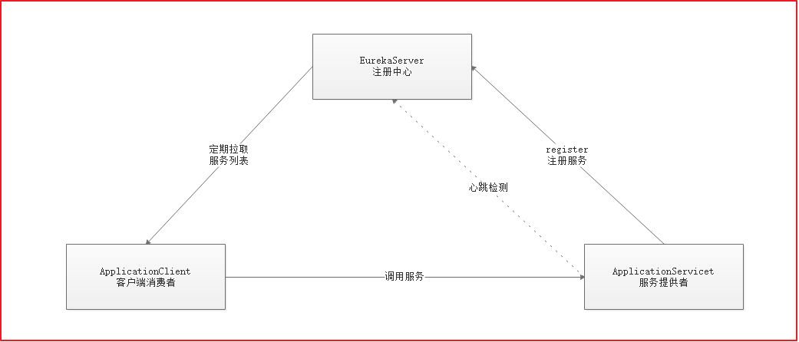
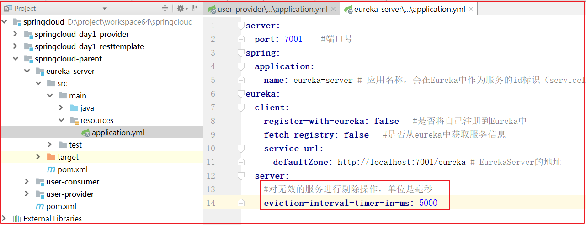

#### 4.2.2 原理图

基本架构图



Eureka：就是服务注册中心(可以是一个集群)，对外暴露自己的地址

服务提供者：启动后向Eureka注册自己的信息(地址，提供什么服务)

服务消费者：向Eureka订阅服务，Eureka会将对应服务的所有提供者地址列表发送给消费者，并且定期更新

心跳(续约)：提供者定期通过http方式向Eureka刷新自己的状态

eureka-server工程application.yml配置

```properties
server:
  port: 7001    #端口号
spring:
  application:
    name: eureka-server # 应用名称，会在Eureka中作为服务的id标识（serviceId）
eureka:
  client:
    register-with-eureka: false   # 默认是true  是否将自己注册到Eureka中，因为本身自己就是服务端，所以需要关闭。
    fetch-registry: false   #默认是true  是否从eureka注册中心获取服务信息，因为本身自己就是服务端，所以需要关闭。
    service-url:
      defaultZone: http://localhost:7001/eureka # EurekaServer的地址， 将来客户端通过该地址进行注册
spring:
  application:
    name: eureka- server  # 给该微服务指定名称应用系统的名称(唯一标识)

```

服务提供者-注册服务

```properties
server:
  port: 18081
spring:
  datasource:
    driver-class-name: com.mysql.cj.jdbc.Driver
    username: root
    password: itcast
    url: jdbc:mysql://127.0.0.1:3306/springcloud?useUnicode=true&characterEncoding=UTF-8&serverTimezone=UTC
  application:
    name: user-provider #服务的名字,不同的应用，名字不同，如果是集群，名字需要相同
#指定eureka服务地址
eureka:
  client:
    service-url:
      # EurekaServer的地址
      defaultZone: http://localhost:7001/eureka
```


#### 4.2.4 Eureka详解

##### 4.2.4.1 基础架构

Eureka架构中的三个核心角色

```properties
1.服务注册中心：Eureka服务端应用，提供服务注册发现功能，eureka-server
2.服务提供者：提供服务的应用
  要求统一对外提供Rest风格服务即可
  本例子：user-provider
3.服务消费者：从注册中心获取服务列表，知道去哪调用服务方，user-consumer
```


##### 4.2.4.2 Eureka客户端

服务提供者要向EurekaServer注册服务，并完成服务续约等工作

**服务注册:**

```properties
1. 当我们开启了客户端发现注解@DiscoveryClient。同时导入了eureka-client依赖坐标
2. 同时配置Eureka服务注册中心地址在配置文件中
3. 服务在启动时，检测是否有@DiscoveryClient注解和配置信息
4. 如果有，则会向注册中心发起注册请求，携带服务元数据信息(IP、端口等)
5. Eureka注册中心会把服务的信息保存在Map中。
```


**服务续约：**

服务注册完成以后，服务提供者会维持一个`心跳`，保存服务处于存在状态。这个称之为服务续约(renew)。


上图配置如下：

```yml
#租约到期，服务时效时间，默认值90秒
lease-expiration-duration-in-seconds: 150
#租约续约间隔时间，默认30秒
lease-renewal-interval-in-seconds: 30
```

参数说明：

```properties
1.两个参数可以修改服务续约行为
  lease-renewal-interval-seconds:90，租约到期时效时间，默认90秒
  lease-expiration-duration-in-seconds:30，租约续约间隔时间，默认30秒
2.服务超过90秒没有发生心跳，EurekaServer会将服务从列表移除[前提是EurekaServer关闭了自我保护]
```


**获取服务列表：**


上图配置如下：

```yml
registry-fetch-interval-seconds: 30
```

说明：

```properties
服务消费者启动时，会检测是否获取服务注册信息配置
如果是，则会从 EurekaServer服务列表获取只读备份，缓存到本地
每隔30秒，会重新获取并更新数据
每隔30秒的时间可以通过配置registry-fetch-interval-seconds修改
```


##### 4.2.4.3 失效剔除和自我保护

**服务下线：**

```
当服务正常关闭操作时，会发送服务下线的REST请求给EurekaServer。
服务中心接受到请求后，将该服务置为下线状态

```


**失效剔除：**

```
服务中心每隔一段时间(默认60秒)将清单中没有续约的服务剔除。
通过eviction-interval-timer-in-ms配置可以对其进行修改，单位是毫秒

```

剔除时间配置



上图代码如下：

```properties
eviction-interval-timer-in-ms: 5000
```


**自我保护：**

Eureka会统计服务实例最近15分钟心跳续约的比例是否低于85%，如果低于则会触发自我保护机制。

服务中心页面会显示如下提示信息


含义：紧急情况！Eureka可能错误地声称实例已经启动，而事实并非如此。续约低于阈值，因此实例不会为了安全而过期。

```properties
1.自我保护模式下，不会剔除任何服务实例
2.自我保护模式保证了大多数服务依然可用
3.通过enable-self-preservation配置可用关停自我保护，默认值是打开
```

关闭自我保护


上图配置如下：

```properties
enable-self-preservation: false
```


### 4.3 小结

- 理解Eureka的原理图:

  ```properties
  Eureka：就是服务注册中心(可以是一个集群)，对外暴露自己的地址
  服务提供者：启动后向Eureka注册自己的信息(地址，提供什么服务)
  服务消费者：向Eureka订阅服务，Eureka会将对应服务的所有提供者地址列表发送给消费者，并且定期更新
  心跳(续约)：提供者定期通过http方式向Eureka刷新自己的状态
  ```

- 能实现Eureka服务的搭建:引入依赖包，配置配置文件，在启动类上加`@EnableEurekaServer`。

- 能实现服务提供者向Eureka注册服务

  ```properties
  1.引入eureka客户端依赖包
  2.在application.yml中配置Eureka服务地址
  3.在启动类上添加@EnableDiscoveryClient或者@EnableEurekaClient 
  ```

- 能实现服务消费者向Eureka注册服务

  ```properties
  1.引入eureka客户端依赖包
  2.在application.yml中配置Eureka服务地址
  3.在启动类上添加@EnableDiscoveryClient或者@EnableEurekaClient 
  ```

- 能实现消费者通过Eureka访问服务提供者