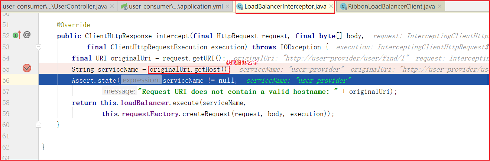
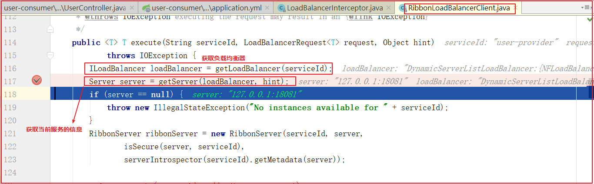

#### 5.2.1 Ribbon 简介

什么是Ribbon？

Ribbon是Netflix发布的负载均衡器，有助于控制HTTP客户端行为。为Ribbon配置服务提供者地址列表后，Ribbon就可基于负载均衡算法，自动帮助服务消费者请求。

Ribbon默认提供的负载均衡算法：轮询，随机,重试法,加权。当然，我们可用自己定义负载均衡算法

##### 5.2.2.2 开启负载均衡

(1)客户端开启负载均衡

Eureka已经集成Ribbon，所以无需引入依赖,要想使用Ribbon，直接在RestTemplate的配置方法上添加`@LoadBalanced`注解即可

修改`user-consumer`的`com.itheima.UserConsumerApplication`启动类，在`restTemplate()`方法上添加`@LoadBalanced`注解，代码如下：


##### 5.2.2.3 其他负载均衡策略配置

配置修改轮询策略：Ribbon默认的负载均衡策略是轮询，通过如下

```yml
# 修改服务地址轮询策略，默认是轮询，配置之后变随机
user-provider:
  ribbon:
    #轮询
    #NFLoadBalancerRuleClassName: com.netflix.loadbalancer.RoundRobinRule
    #随机算法
    #NFLoadBalancerRuleClassName: com.netflix.loadbalancer.RandomRule
    #重试算法,该算法先按照轮询的策略获取服务,如果获取服务失败则在指定的时间内会进行重试，获取可用的服务
    #NFLoadBalancerRuleClassName: com.netflix.loadbalancer.RetryRule
    #加权法,会根据平均响应时间计算所有服务的权重，响应时间越快服务权重越大被选中的概率越大。刚启动时如果同统计信息不足，则使用轮询的策略，等统计信息足够会切换到自身规则。
    NFLoadBalancerRuleClassName: com.netflix.loadbalancer.ZoneAvoidanceRule
```

SpringBoot可以修改负载均衡规则，配置为`ribbon.NFLoadBalancerRuleClassName`

格式{服务名称}.ribbon.NFLoadBalancerRuleClassName

#### 5.2.3 负载均衡源码跟踪探究

为什么只输入了Service名称就可以访问了呢？不应该需要获取ip和端口吗？

负载均衡器动态的从服务注册中心中获取服务提供者的访问地址(host、port)

显然是有某个组件根据Service名称，获取了服务实例ip和端口。就是LoadBalancerInterceptor

这个类会对RestTemplate的请求进行拦截，然后从Eureka根据服务id获取服务列表，随后利用负载均衡算法得到真正服务地址信息，替换服务id。

源码跟踪步骤：

打开LoadBalancerInterceptor类，断点打入intercept方法中



继续跟入execute方法：发现获取了18081发端口的服务



再跟下一次，发现获取的是18081和18083之间切换


通过代码断点内容判断，果然是实现了负载均衡