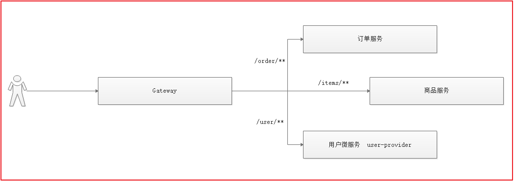
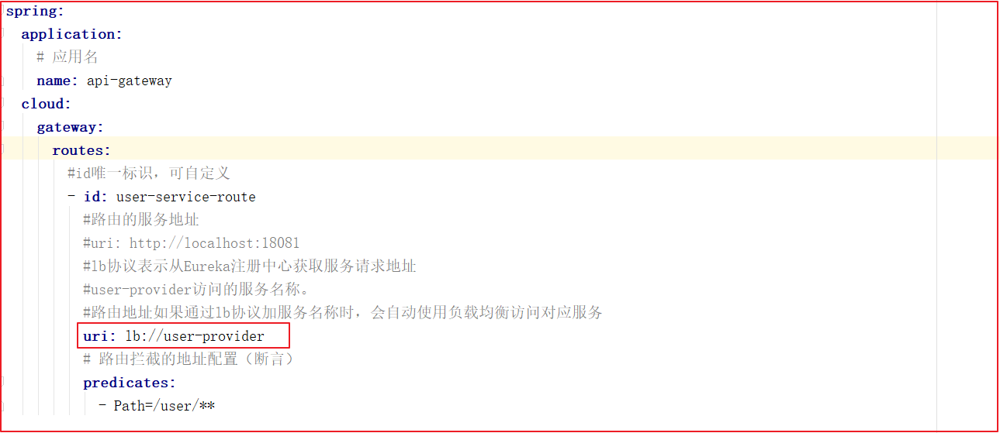
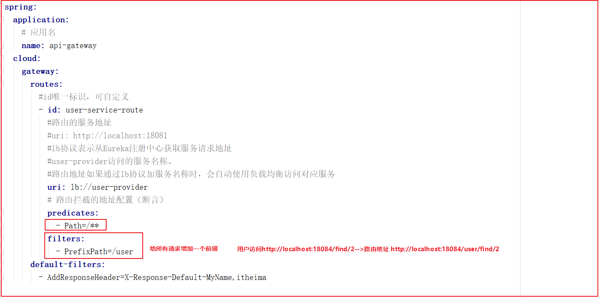

# 骨干

==网关作用：为微服务提供统一的路由管理，可以在路由管理基础上进行一系列的过滤，可以做一系列的监控操作，限流。==

##动态路由

​          .#lb协议表示从Eureka注册中心获取服务请求地址
          #user-provider访问的服务名称。
          #路由地址如果通过lb协议加服务名称时，会自动使用负载均衡访问对应服务
          uri: lb://user-provider

**根据服务名称**，去Eureka注册中心查找服务对应的所有实例列表，然后进行动态路由！

## 过滤器

##### 2.2.5.1 过滤器的分类

```properties
默认过滤器：出厂自带，实现好了拿来就用，不需要实现
  全局默认过滤器
  局部默认过滤器
自定义过滤器：根据需求自己实现，实现后需配置，然后才能用哦。
  全局过滤器：作用在所有路由上。
  局部过滤器：配置在具体路由下，只作用在当前路由上。
```

##### 2.2.5.2 默认过滤器配置

默认过滤器有两个：全局默认过滤器和局部默认过滤器。

**全局过滤器：对输出响应头设置属性**

对输出的响应设置其头部属性名称为X-Response-Default-MyName,值为itheima

**局部过滤器：**通过局部默认过滤器，修改请求路径。局部过滤器在这里介绍两种：添加路径前缀、去除路径前缀。

**第一：添加路径前缀：**

**第二：去除路径前缀：**

**全局过滤器自定义：**

创建一个类 implements GlobalFilter, Ordered  重写filter与order  方法 在filter放行

**局部过滤器自定义：**

创建一个类extends AbstractNameValueGatewayFilterFactory  重写filter  放行

# ------------------------------

==网关作用：为微服务提供统一的路由管理，可以在路由管理基础上进行一系列的过滤，可以做一系列的监控操作，限流。==

#### 2.2.1 Gateway 简介

Spring Cloud Gateway 是Spring Cloud团队的一个全新项目，基于Spring 5.0、SpringBoot2.0、Project Reactor 等技术开发的网关。 ==旨在为微服务架构提供一种简单有效统一的API路由管理方式。==

Spring Cloud Gateway 作为SpringCloud生态系统中的网关，目标是替代Netflix Zuul。Gateway不仅提供统一路由方式，并且==基于Filter链的方式提供网关的基本功能。例如：安全，监控/指标，和限流。==

**本身也是一个微服务，需要注册到Eureka**

**网关的核心功能：**过滤、路由

**核心概念：**通过画图解释

- **路由(route)：**
- **断言Predicate函数：**路由转发规则
- **过滤器(Filter)：**

#### 2.2.3 路由配置



通过网关配置一个路由功能，用户访问网关的时候,如果用户请求的路径是以`/user`开始，则路由到`user-provider`服务去,修改application.yml配置即可实现，配置如下：

```properties
spring:
  application:
    # 应用名
    name: api-gateway
  cloud:
    gateway:
      routes:
        #id唯一标识，可自定义
        - id: user-service-route
          #路由的服务地址
          uri: http://localhost:18081
          # 路由拦截的地址配置（断言）
          predicates:
            - Path=/user/**
```

#### 2.2.4 动态路由


刚才路由规则中，我们把路径对应服务地址写死了！如果服务提供者集群的话，这样做不合理。应该是**根据服务名称**，去Eureka注册中心查找服务对应的所有实例列表，然后进行动态路由！

**修改映射配置：通过服务名称获取：**

修改application.yml

因为已经配置了Eureka客户端，可以从Eureka获取服务的地址信息，修改application.yml文件如下:



上图代码如下：

```properties
spring:
  application:
    # 应用名
    name: api-gateway
  cloud:
    gateway:
      routes:
        #id唯一标识，可自定义
        - id: user-service-route
          #路由的服务地址
          #uri: http://localhost:18081
          #lb协议表示从Eureka注册中心获取服务请求地址
          #user-provider访问的服务名称。
          #路由地址如果通过lb协议加服务名称时，会自动使用负载均衡访问对应服务
          uri: lb://user-provider
          # 路由拦截的地址配置（断言）
          predicates:
            - Path=/user/**
```

路由配置中uri所用的协议为lb时，gateway将把user-provider解析为实际的主机和端口，并通过Ribbon进行负载均衡。

#### 2.2.5 过滤器

过滤器作为Gateway的重要功能。常用于请求鉴权、服务调用时长统计、修改请求或响应header、限流、去除路径等等...


##### 2.2.5.1 过滤器的分类

```properties
默认过滤器：出厂自带，实现好了拿来就用，不需要实现
  全局默认过滤器
  局部默认过滤器
自定义过滤器：根据需求自己实现，实现后需配置，然后才能用哦。
  全局过滤器：作用在所有路由上。
  局部过滤器：配置在具体路由下，只作用在当前路由上。
```

##### 2.2.5.2 默认过滤器配置

默认过滤器有两个：全局默认过滤器和局部默认过滤器。

**全局过滤器：对输出响应头设置属性**

对输出的响应设置其头部属性名称为X-Response-Default-MyName,值为itheima

修改配置文件

```yml
spring:
  cloud:
    gateway:
     # 配置全局默认过滤器
      default-filters:
      # 往响应过滤器中加入信息
        - AddResponseHeader=X-Response-Default-MyName,itheima
```


查看浏览器响应头信息!


**局部过滤器：**通过局部默认过滤器，修改请求路径。局部过滤器在这里介绍两种：添加路径前缀、去除路径前缀。

**第一：添加路径前缀：**

在gateway中可以通过配置路由的过滤器PrefixPath 实现映射路径中的前缀

配置请求地址添加路径前缀过滤器



上图配置如下：

```yml
spring:
  application:
    # 应用名
    name: api-gateway
  cloud:
    gateway:
      routes:
        #id唯一标识，可自定义
        - id: user-service-route
          #路由的服务地址
          #uri: http://localhost:18081
          #lb协议表示从Eureka注册中心获取服务请求地址
          #user-provider访问的服务名称。
          #路由地址如果通过lb协议加服务名称时，会自动使用负载均衡访问对应服务
          uri: lb://user-provider
          # 路由拦截的地址配置（断言）
          predicates:
            - Path=/**
          filters:
            # 请求地址添加路径前缀过滤器
            - PrefixPath=/user
      default-filters:
        - AddResponseHeader=X-Response-Default-MyName,itheima
```

路由地址信息：

| 配置             | 访问地址                      | 路由地址                           |
| ---------------- | ----------------------------- | ---------------------------------- |
| PrefixPath=/user | http://localhost:18084/find/2 | http://localhost:18081/user/find/2 |


**第二：去除路径前缀：**

在gateway中通过配置路由过滤器StripPrefix，实现映射路径中地址的去除。通过StripPrefix=1来指定路由要去掉的前缀个数。如：路径/api/user/1将会被路由到/user/1。

配置去除路径前缀过滤器


上图配置如下：

```yml
spring:
  application:
    # 应用名
    name: api-gateway
  cloud:
    gateway:
      routes:
        #id唯一标识，可自定义
        - id: user-service-route
          #路由的服务地址
          #uri: http://localhost:18081
          #lb协议表示从Eureka注册中心获取服务请求地址
          #user-provider访问的服务名称。
          #路由地址如果通过lb协议加服务名称时，会自动使用负载均衡访问对应服务
          uri: lb://user-provider
          # 路由拦截的地址配置（断言）
          predicates:
            - Path=/**
          filters:
            # 请求地址添加路径前缀过滤器
            #- PrefixPath=/user
            # 去除路径前缀过滤器
            - StripPrefix=1
      default-filters:
        - AddResponseHeader=X-Response-Default-MyName,itheima
```

路由地址信息：

| 配置          | 访问地址                                 | 路由地址                           |
| ------------- | ---------------------------------------- | ---------------------------------- |
| StripPrefix=1 | http://localhost:18084/api/user/find/2   | http://localhost:18081/user/find/2 |
| StripPrefix=2 | http://localhost:18084/api/r/user/find/2 | http://localhost:18081/user/find/2 |


##### 2.2.5.3 自定义过滤器案例

自定义过滤器也有两个：全局自定义过滤器，和局部自定义过滤器。

自定义全局过滤器的案例，自定义局部过滤器的案例。

**自定义全局过滤器的案例：**模拟登陆校验。

基本逻辑：如果请求中有Token参数，则认为请求有效放行，如果没有则拦截提示授权无效


###### 2.2.5.3.1 全局过滤器自定义：

**实现步骤：**

```
1.在gateway-service工程编写全局过滤器类GlobalFilter,Ordered
2.编写业务逻辑代码
3.访问接口测试，加token和不加token。

```


**实现过程：**

在`gateway-service`中创建`com.itheima.filter.LoginGlobalFilter`全局过滤器类,代码如下：

```java
@Component
public class LoginGlobalFilter implements GlobalFilter, Ordered {

    /***
     * 过滤拦截
     * @param exchange
     * @param chain
     * @return
     */
    @Override
    public Mono<Void> filter(ServerWebExchange exchange, GatewayFilterChain chain) {
        //获取请求参数
        String token = exchange.getRequest().getQueryParams().getFirst("token");

        //如果token为空，则表示没有登录
        if(StringUtils.isEmpty(token)){
            //没登录,状态设置403
            exchange.getResponse().setStatusCode(HttpStatus.PAYLOAD_TOO_LARGE);
            //结束请求
            return exchange.getResponse().setComplete();
        }

        //放行
        return chain.filter(exchange);
    }

    /***
     * 定义过滤器执行顺序
     * 返回值越小，越靠前执行
     * @return
     */
    @Override
    public int getOrder() {
        return 0;
    }
}
```


测试：不携带token  `<http://localhost:18084/api/user/find/2>`效果如下：


测试：携带token `<http://localhost:18084/api/user/find/2?token=abc>` 此时可以正常访问。

###### 2.2.5.3.2 局部过滤器定义

自定义局部过滤器，该过滤器在控制台输出配置文件中指定名称的请求参数及参数的值,以及判断是否携带请求中参数,打印.

**实现步骤：**

```properties
1. 在gateway-service中编写MyParamGatewayFilterFactory类
2. 实现业务代码：循环请求参数中是否包含name，如果包含则输出参数值,并打印在第三步配置的参数名和值
3. 修改配置文件
4. 访问请求测试，带name参数
```


**实现过程：**

在gateway_service中编写MyParamGatewayFilterFactory类

```java
@Component
public class MyParamGatewayFilterFactory extends AbstractNameValueGatewayFilterFactory {
    /**
     * 处理过程  默认需要在配置配置文件中配置 NAME ,VALUE
     *
     * @param config
     * @return
     */
    public GatewayFilter apply(NameValueConfig config) {

        return new GatewayFilter() {
            //- MyParam=name,value
            @Override
            public Mono<Void> filter(ServerWebExchange exchange, GatewayFilterChain chain) {
                String name111 = config.getName();//获取参数名name的值
                String value111 = config.getValue();//获取参数名value的值
                System.out.println("获取配置中的参数的NAME值:" + name111);
                System.out.println("获取配置中的参数的VALUE值:" + value111);
                //获取参数值
                String name = exchange.getRequest().getQueryParams().getFirst("name");
                if (!StringUtils.isEmpty(name)) {
                    System.out.println("哈哈:" + name);
                }
                //添加到头信息或者作为参数传递等等.
                return chain.filter(exchange);
            }
        };
    }
}
```


修改application.yml配置文件


测试访问，检查后台是否输出name和itheima；访问`<http://localhost:18084/api/user/find/2?name=itheima&tomen=aaa>`会输出。

