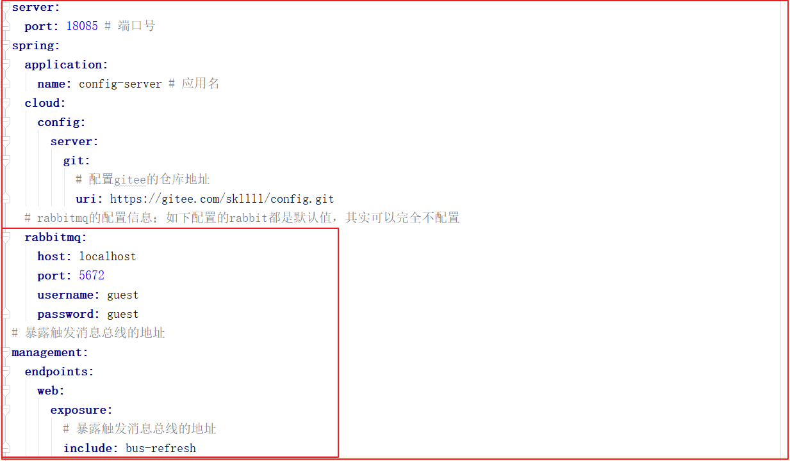
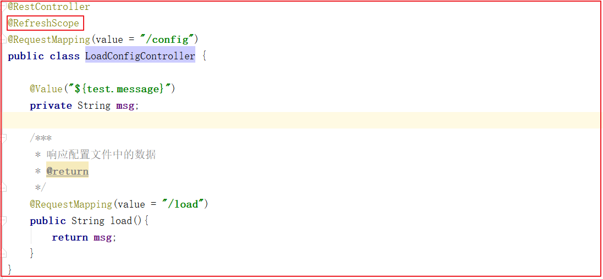
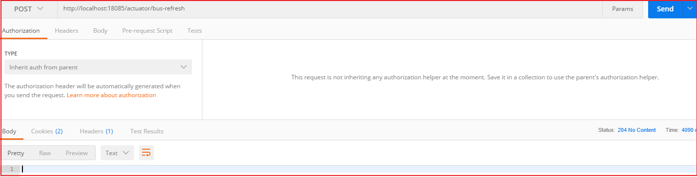

## 4 消息总线 Spring Cloud Bus

SpringCloud Bus，解决上述问题，实现配置自动更新。

注意：SpringCloudBus基于RabbitMQ实现，默认使用本地的消息队列服务，所以需要提前安装并启动RabbitMQ。


### 4.1 Bus简介

Bus是用轻量的消息代理将分布式的节点连接起来，可以用于**广播配置文件的更改**或者服务的监控管理。

Bus可以为微服务做监控，也可以实现应用程序之间互相通信。Bus可选的消息代理**RabbitMQ**和Kafka。

广播出去的配置文件服务会进行本地缓存。

**实现过程**：

#### 改造配置中心

(2)修改application.yml配置文件

修改`config-server`的application.yml，如下配置的rabbit都是默认值，其实可以完全不配置,代码如下：



上图配置如下：

```properties
# 注释版本
server:
  port: 18085 # 端口号
spring:
  application:
    name: config-server # 应用名
  cloud:
    config:
      server:
        git:
          # 配置gitee的仓库地址
          uri: https://gitee.com/skllll/config.git
  # rabbitmq的配置信息；如下配置的rabbit都是默认值，其实可以完全不配置
  rabbitmq:
    host: localhost
    port: 5672
    username: guest
    password: guest
# 暴露触发消息总线的地址
management:
  endpoints:
    web:
      exposure:
        # 暴露触发消息总线的地址
        include: bus-refresh

# Eureka服务中心配置
eureka:
  client:
    service-url:
      # 注册Eureka Server集群
      defaultZone: http://127.0.0.1:7001/eureka
# com.itheima 包下的日志级别都为Debug
logging:
  level:
    com: debug
```

#### 改造用户服务

改造步骤：**

```properties
1. 在用户微服务user_service项目中加入Bus相关依赖
2. 修改user_service项目的bootstrap.yml，加入RabbitMQ的配置信息
3. UserController类上加入@RefreshScope刷新配置注解
4. 测试
```


**实现过程：**

(1)引入依赖

修改`user-provider`引入如下依赖：

```xml
<!--消息总线依赖-->
<dependency>
    <groupId>org.springframework.cloud</groupId>
    <artifactId>spring-cloud-bus</artifactId>
</dependency>
<!--RabbitMQ依赖-->
<dependency>
    <groupId>org.springframework.cloud</groupId>
    <artifactId>spring-cloud-stream-binder-rabbit</artifactId>
</dependency>
<!--健康监控依赖-->
<dependency>
    <groupId>org.springframework.boot</groupId>
    <artifactId>spring-boot-starter-actuator</artifactId>
</dependency>
```


(2)添加bootstrap.yml文件

在`user-provider`的resources目录下添加bootstrap.yml，添加rabbitmq配置，代码如下：

```properties
# 注释版本
spring:
  cloud:
    config:
      name: user-provider # 与远程仓库中的配置文件的application保持一致，{application}-{profile}.yml
      profile: dev # 远程仓库中的配置文件的profile保持一致
      label: master # 远程仓库中的版本保持一致
      discovery:
        enabled: true # 使用配置中心
        service-id: config-server # 配置中心服务id
# rabbitmq的配置信息；如下配置的rabbit都是默认值，其实可以完全不配置
  rabbitmq:
    host: localhost
    port: 5672
    username: guest
    password: guest
#向Eureka服务中心集群注册服务
eureka:
  client:
    service-url:
      defaultZone: http://127.0.0.1:7001/eureka
```

(3)添加刷新配置

修改`user-provider`的`com.itheima.controller.LoadConfigController`，添加一个`@RefreshScope`注解刷新配置信息，代码如下：



@RefreshScope：用于启用刷新配置文件的信息。

(6)刷新配置

使用Postman以POST方式请求`http://localhost:18085/actuator/bus-refresh`



请求地址中actuator是固定的，bus-refresh对应的是配置中心的config-server中的application.yml文件的配置项include的内容

