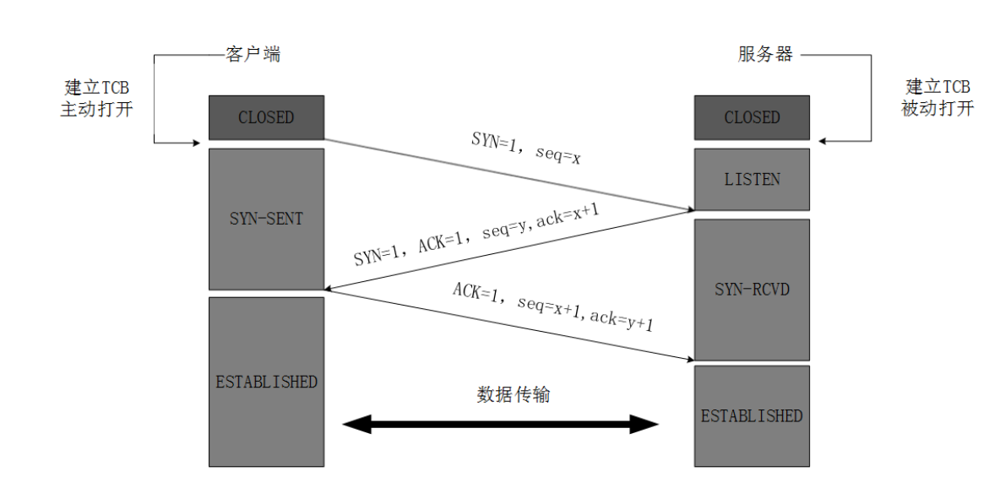

第一次握手：主机 A 发送位码为 syn＝1,随机产生 seq number=1234567 的数据包到服务器，主机 B
由 SYN=1 知道，A 要求建立联机；
第二次握手：主机 B 收到请求后要确认联机信息，向 A 发 送 ack number=( 主 机 A 的
seq+1),syn=1,ack=1,随机产生 seq=7654321 的包
第三次握手：主机 A 收到后检查 ack number 是否正确，即第一次发送的 seq number+1,以及位码
ack 是否为 1，若正确，主机 A 会再发送 ack number=(主机 B 的 seq+1),ack=1，主机 B 收到后确认

1. TCP服务器进程先创建传输控制块TCB，时刻准备接受客户进程的连接请求，此时服务器就进入了LISTEN（监听）状态；
2. TCP客户进程也是先创建传输控制块TCB，然后向服务器发出连接请求报文，这是报文首部中的同部位SYN=1，同时选择一个初始序列号 seq=x ，此时，TCP客户端进程进入了 SYN-SENT（同步已发送状态）状态。TCP规定，SYN报文段（SYN=1的报文段）不能携带数据，但需要消耗掉一个序号。
3. TCP服务器收到请求报文后，如果同意连接，则发出确认报文。确认报文中应该 ACK=1，SYN=1，确认号是ack=x+1，同时也要为自己初始化一个序列号 seq=y，此时，TCP服务器进程进入了SYN-RCVD（同步收到）状态。这个报文也不能携带数据，但是同样要消耗一个序号。
4. TCP客户进程收到确认后，还要向服务器给出确认。确认报文的ACK=1，ack=y+1，自己的序列号seq=x+1，此时，TCP连接建立，客户端进入ESTABLISHED（已建立连接）状态。TCP规定，ACK报文段可以携带数据，但是如果不携带数据则不消耗序号。
5. 当服务器收到客户端的确认后也进入ESTABLISHED状态，此后双方就可以开始通信了。

为什么要三次握⼿

 三次握⼿的⽬的是建⽴可靠的通信信道，说到通讯，简单来说就是数据的发送与接收，⽽三次握⼿最主 要的⽬的就是双⽅确认⾃⼰与对⽅的发送与接收是正常的。 

第⼀次握⼿：Client 什么都不能确认；Server 确认了对⽅发送正常，⾃⼰接收正常 

第⼆次握⼿：Client 确认了：⾃⼰发送、接收正常，对⽅发送、接收正常；Server 确认了：对⽅发送 正常，⾃⼰接收正常 

第三次握⼿：Client 确认了：⾃⼰发送、接收正常，对⽅发送、接收正常；Server 确认了：⾃⼰发 送、接收正常，对⽅发送、接收正常 

所以三次握⼿就能确认双发收发功能都正常，缺⼀不可。 