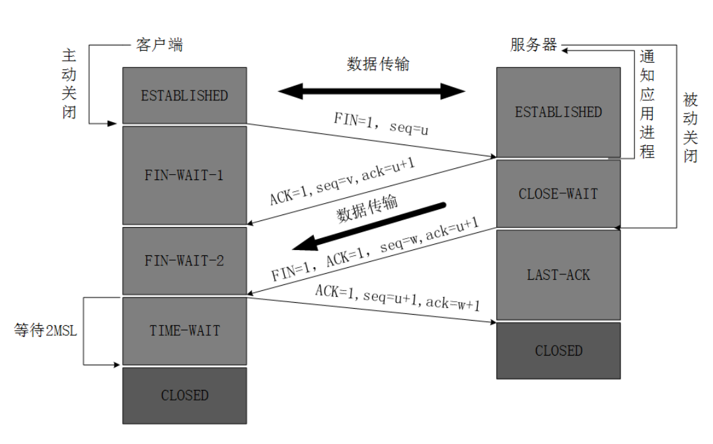

```
1） 关闭客户端到服务器的连接：首先客户端 A 发送一个 FIN，用来关闭客户到服务器的数据传送，
然后等待服务器的确认。其中终止标志位 FIN=1，序列号 seq=u
2） 服务器收到这个 FIN，它发回一个 ACK，确认号 ack 为收到的序号加 1。
 3） 关闭服务器到客户端的连接：也是发送一个 FIN 给客户端。
4） 客户段收到 FIN 后，并发回一个 ACK 报文确认，并将确认序号 seq 设置为收到序号加 1。
 首先进行关闭的一方将执行主动关闭，而另一方执行被动关闭
```

```
1客户端进程发出连接释放报文，并且停止发送数据。释放数据报文首部，FIN=1，其序列号为seq=u（等于前面已经传送过来的数据的最后一个字节的序号加1），此时，客户端进入FIN-WAIT-1（终止等待1）状态。 TCP规定，FIN报文段即使不携带数据，也要消耗一个序号。
2服务器收到连接释放报文，发出确认报文，ACK=1，ack=u+1，并且带上自己的序列号seq=v，此时，服务端就进入了CLOSE-WAIT（关闭等待）状态。TCP服务器通知高层的应用进程，客户端向服务器的方向就释放了，这时候处于半关闭状态，即客户端已经没有数据要发送了，但是服务器若发送数据，客户端依然要接受。这个状态还要持续一段时间，也就是整个CLOSE-WAIT状态持续的时间。
3客户端收到服务器的确认请求后，此时，客户端就进入FIN-WAIT-2（终止等待2）状态，等待服务器发送连接释放报文（在这之前还需要接受服务器发送的最后的数据）。
4服务器将最后的数据发送完毕后，就向客户端发送连接释放报文，FIN=1，ack=u+1，由于在半关闭状态，服务器很可能又发送了一些数据，假定此时的序列号为seq=w，此时，服务器就进入了LAST-ACK（最后确认）状态，等待客户端的确认。
5客户端收到服务器的连接释放报文后，必须发出确认，ACK=1，ack=w+1，而自己的序列号是seq=u+1，此时，客户端就进入了TIME-WAIT（时间等待）状态。注意此时TCP连接还没有释放，必须经过2∗ *∗MSL（最长报文段寿命）的时间后，当客户端撤销相应的TCB后，才进入CLOSED状态。
6服务器只要收到了客户端发出的确认，立即进入CLOSED状态。同样，撤销TCB后，就结束了这次的TCP连接。可以看到，服务器结束TCP连接的时间要比客户端早一些。1
```




任何⼀⽅都可以在数据传送结束后发出连接释放的通知，待对⽅确认后进⼊半关闭状态。当另⼀⽅也没 有数据再发送的时候，则发出连接释放通知，对⽅确认后就完全关闭了TCP连接。 

举个例⼦：A 和 B 打电话，通话即将结束后，A 说“我没啥要说的了”，B回答“我知道了”，但是 B 可 能还会有要说的话，A 不能要求 B 跟着⾃⼰的节奏结束通话，于是 B 可能⼜巴拉巴拉说了⼀通，最后 B 说“我说完了”，A 回答“知道了”，这样通话才算结束。 

上⾯讲的⽐较概括，推荐⼀篇讲的⽐较细致的⽂ 章：https://blog.csdn.net/qzcsu/article/details/72861891 