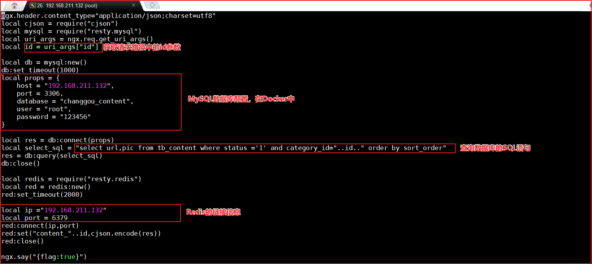

###(1)实现思路-查询数据放入redis中

创建/root/lua目录，在该目录下创建update_content.lua： 目的就是连接mysql  查询数据 并存储到redis中。

 目的就是连接mysql  查询数据 并存储到redis中。update_content.lua

```
1.获取请求路径参数ID
2.配置数据库信息,编写sql语句根据请求参数查询需要缓存的数据
3.配置redis信息,将数据设置进redis
```



### (2)实现思路-从redis中获取数据

### 加入openresty本地缓存

如上的方式没有问题，但是如果请求都到redis，redis压力也很大，所以我们一般采用多级缓存的方式来减少下游系统的服务压力。参考基本思路图的实现。

先查询openresty本地缓存 如果 没有

再查询redis中的数据，如果没有

再查询mysql中的数据，但凡有数据 则返回即可。

修改read_content.lua文件，代码如下：

```
1.获取请求路径参数ID
2.根据ID获取本地缓存
3.如果本地缓存为空,则从redis中取
4.redis也为空则从数据库中查并缓存到redis中
5.最终响应出去
```


