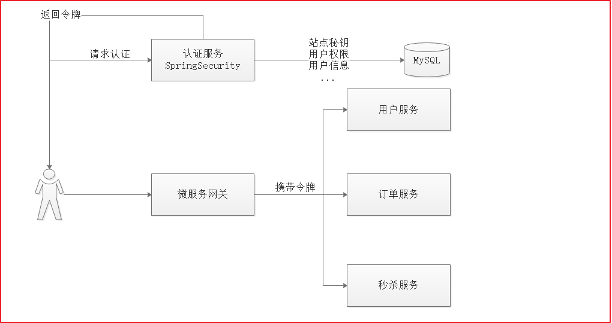

### 2.3 Spring security Oauth2认证解决方案

本项目采用 Spring security + Oauth2完成用户认证及用户授权，Spring security 是一个强大的和高度可定制的身份验证和访问控制框架，Spring security 框架集成了Oauth2协议，下图是项目认证架构图：    



1、用户请求认证服务完成认证。 

2、认证服务下发用户身份令牌，拥有身份令牌表示身份合法。 

3、用户携带令牌请求资源服务，请求资源服务必先经过网关。 

4、网关校验用户身份令牌的合法，不合法表示用户没有登录，如果合法则放行继续访问。 

5、资源服务获取令牌，根据令牌完成授权。 

6、资源服务完成授权则响应资源信息。

#### 3.3.2 授权码授权实现

上边例举的黑马程序员网站使用QQ认证的过程就是授权码模式，流程如下： 

1、客户端请求第三方授权 

2、用户(资源拥有者)同意给客户端授权 

3、客户端获取到授权码，请求认证服务器申请 令牌 

4、认证服务器向客户端响应令牌 

5、客户端请求资源服务器的资源，资源服务校验令牌合法性，完成授权 

6、资源服务器返回受保护资源    

#### 3.3.2密码模式实现

**(1)认证**

密码模式（Resource Owner Password Credentials）与授权码模式的区别是申请令牌不再使用授权码，而是直接 通过用户名和密码即可申请令牌。 

测试如下： 

Post请求：http://localhost:9001/oauth/token 

参数： 

grant_type：密码模式授权填写password 

username：账号 

password：密码 

并且此链接需要使用 http Basic认证。


测试数据如下：


**(2)校验令牌**

Spring Security Oauth2提供校验令牌的端点，如下： 

Get: http://localhost:9001/oauth/check_token?token= 

参数： 

token：令牌 

使用postman测试如下:


返回结果：

```properties
{
    "companyId": null,
    "userpic": null,
    "scope": [
        "app"
    ],
    "name": null,
    "utype": null,
    "active": true,
    "id": null,
    "exp": 1990221534,
    "jti": "5b96666e-436b-4301-91b5-d89f9bbe6edb",
    "client_id": "changgou",
    "user_name": "szitheima"
}
```

exp：过期时间，long类型，距离1970年的秒数（new Date().getTime()可得到当前时间距离1970年的毫秒数）。 

user_name： 用户名 

client_id：客户端Id，在oauth_client_details中配置 

scope：客户端范围，在oauth_client_details表中配置 

jti：与令牌对应的唯一标识 companyId、userpic、name、utype、

id：这些字段是本认证服务在Spring Security基础上扩展的用户身份信息    


**(3)刷新令牌**

刷新令牌是当令牌快过期时重新生成一个令牌，它于授权码授权和密码授权生成令牌不同，刷新令牌不需要授权码 也不需要账号和密码，只需要一个刷新令牌、客户端id和客户端密码。 

测试如下： Post：http://localhost:9001/oauth/token 

参数：    

grant_type： 固定为 refresh_token 

refresh_token：刷新令牌（注意不是access_token，而是refresh_token）    


刷新令牌成功，会重新生成新的访问令牌和刷新令牌，令牌的有效期也比旧令牌长。 

刷新令牌通常是在令牌快过期时进行刷新 。

