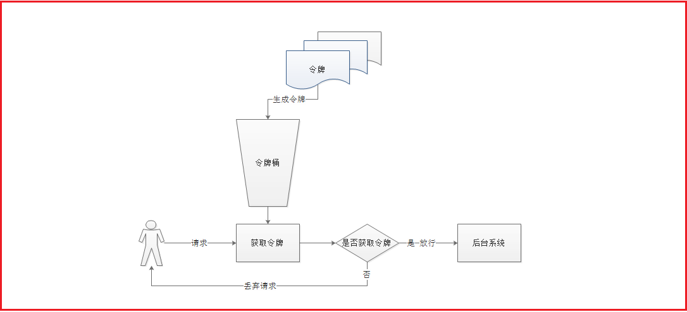
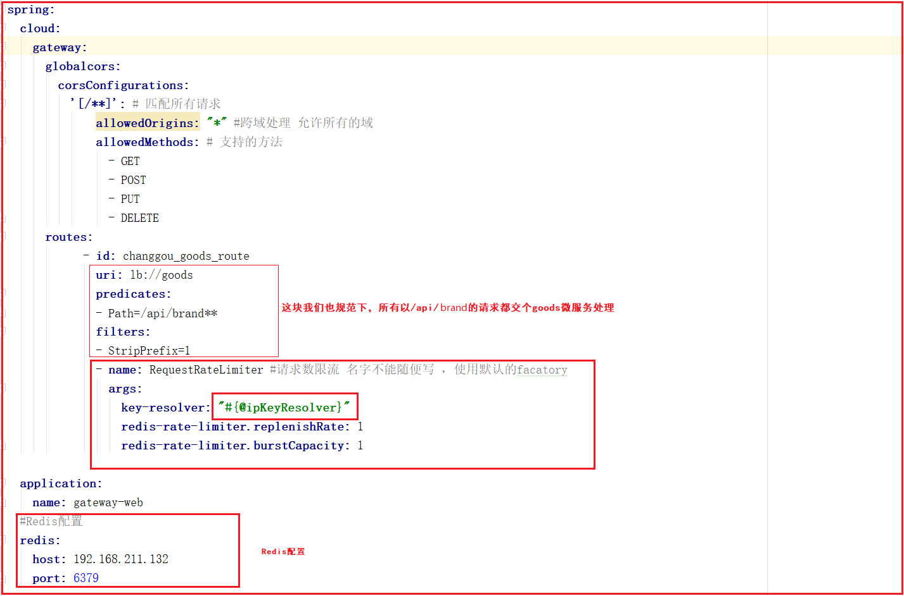
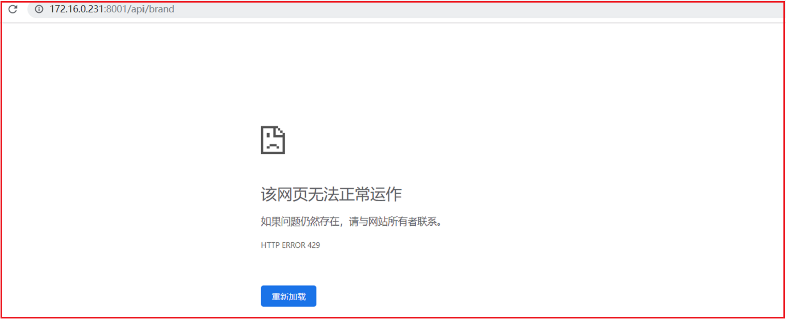

#### 2.5.2 令牌桶算法

令牌桶算法是比较常见的限流算法之一，大概描述如下：
1）所有的请求在处理之前都需要拿到一个可用的令牌才会被处理；
2）根据限流大小，设置按照一定的速率往桶里添加令牌；
3）桶设置最大的放置令牌限制，当桶满时、新添加的令牌就被丢弃或者拒绝；
4）请求达到后首先要获取令牌桶中的令牌，拿着令牌才可以进行其他的业务逻辑，处理完业务逻辑之后，将令牌直接删除；
5）令牌桶有最低限额，当桶中的令牌达到最低限额的时候，请求处理完之后将不会删除令牌，以此保证足够的限流

如下图：



这个算法的实现，有很多技术，Guaua是其中之一，redis客户端也有其实现。

#### 2.5.3 使用令牌桶进行请求次数限流

spring cloud gateway 默认使用redis的RateLimter限流算法来实现。所以我们要使用首先需要引入redis的依赖

(1)引入redis依赖

在changgou-gateway的pom.xml中引入redis的依赖

```xml
<!--redis-->
<dependency>
    <groupId>org.springframework.boot</groupId>
    <artifactId>spring-boot-starter-data-redis-reactive</artifactId>
    <version>2.1.3.RELEASE</version>
</dependency>
```


(2)定义KeyResolver

在Applicatioin引导类中添加如下代码，KeyResolver用于计算某一个类型的限流的KEY也就是说，可以通过KeyResolver来指定限流的Key。

我们可以根据IP来限流，比如每个IP每秒钟只能请求一次，在GatewayWebApplication定义key的获取，获取客户端IP，将IP作为key，如下代码：

```java
/***
 * IP限流
 * @return
 */
@Bean(name="ipKeyResolver")
public KeyResolver userKeyResolver() {
    return new KeyResolver() {
        @Override
        public Mono<String> resolve(ServerWebExchange exchange) {
            //获取远程客户端IP
            String hostName = exchange.getRequest().getRemoteAddress().getAddress().getHostAddress();
            System.out.println("hostName:"+hostName);
            return Mono.just(hostName);
        }
    };
}
```


(3)修改application.yml中配置项，指定限制流量的配置以及REDIS的配置，如图

修改如下图：



配置代码如下：

```yaml
spring:
  cloud:
    gateway:
      globalcors:
        corsConfigurations:
          '[/**]': # 匹配所有请求
              allowedOrigins: "*" #跨域处理 允许所有的域
              allowedMethods: # 支持的方法
                - GET
                - POST
                - PUT
                - DELETE
      routes:
            - id: changgou_goods_route
              uri: lb://goods
              predicates:
              - Path=/api/brand**
              filters:
              - StripPrefix=1
              - name: RequestRateLimiter #请求数限流 名字不能随便写 ，使用默认的facatory
                args:
                  key-resolver: "#{@ipKeyResolver}"
                  redis-rate-limiter.replenishRate: 1
                  redis-rate-limiter.burstCapacity: 1

  application:
    name: gateway-web
  #Redis配置
  redis:
    host: 192.168.211.132
    port: 6379

server:
  port: 8001
eureka:
  client:
    service-url:
      defaultZone: http://127.0.0.1:7001/eureka
  instance:
    prefer-ip-address: true
management:
  endpoint:
    gateway:
      enabled: true
    web:
      exposure:
        include: true
```

解释：

`redis-rate-limiter.replenishRate`是您希望允许用户每秒执行多少请求，而不会丢弃任何请求。这是令牌桶填充的速率

`redis-rate-limiter.burstCapacity`是指令牌桶的容量，允许在一秒钟内完成的最大请求数,将此值设置为零将阻止所有请求。

 key-resolver: "#{@ipKeyResolver}" 用于通过SPEL表达式来指定使用哪一个KeyResolver.

如上配置：

表示 一秒内，允许 一个请求通过，令牌桶的填充速率也是一秒钟添加一个令牌。

最大突发状况 也只允许 一秒内有一次请求，可以根据业务来调整 。


多次请求会发生如下情况



