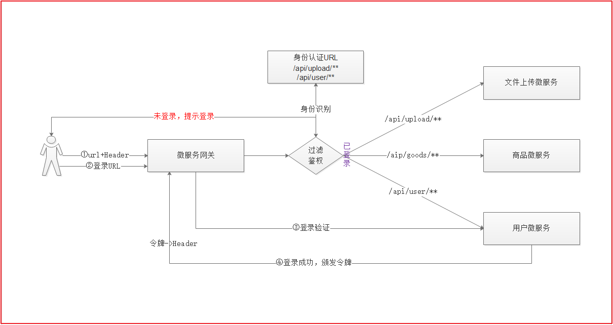

### 4.5 鉴权处理

#### 4.5.1 思路分析



```properties
1.用户通过访问微服务网关调用微服务，同时携带头文件信息
2.在微服务网关这里进行拦截，拦截后获取用户要访问的路径
3.识别用户访问的路径是否需要登录，如果需要，识别用户的身份是否能访问该路径[这里可以基于数据库设计一套权限]
4.如果需要权限访问，用户已经登录，则放行
5.如果需要权限访问，且用户未登录，则提示用户需要登录
6.用户通过网关访问用户微服务，进行登录验证
7.验证通过后，用户微服务会颁发一个令牌给网关，网关会将用户信息封装到头文件中，并响应用户
8.用户下次访问，携带头文件中的令牌信息即可识别是否登录
```

