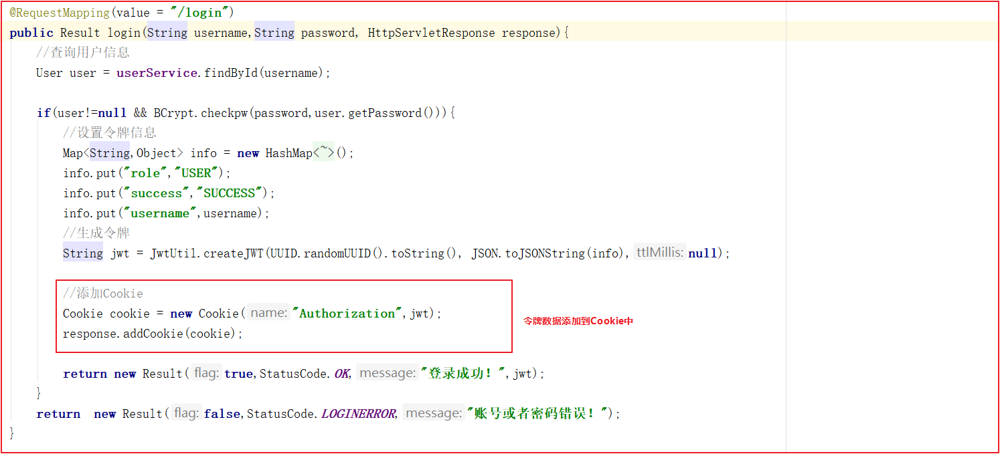
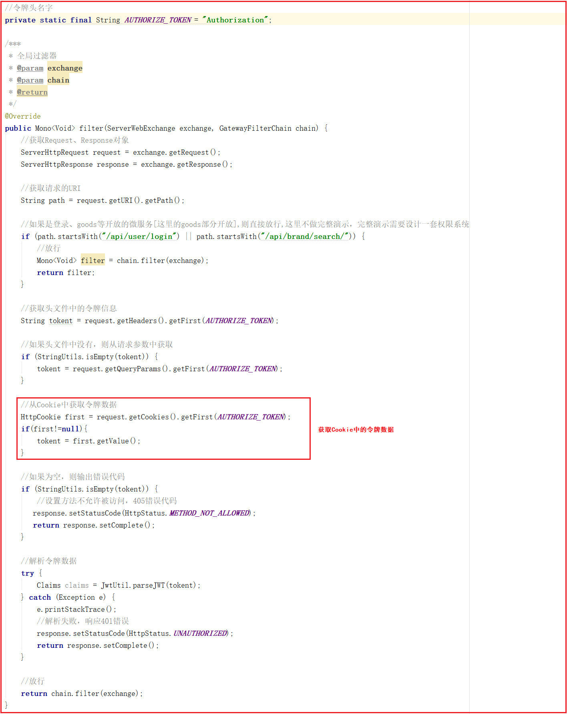
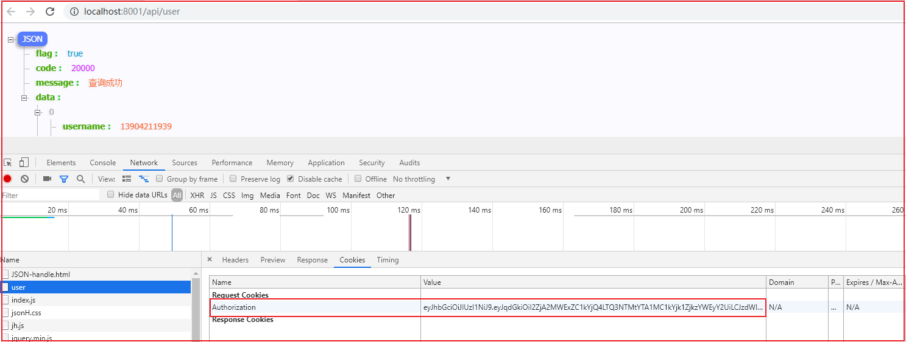
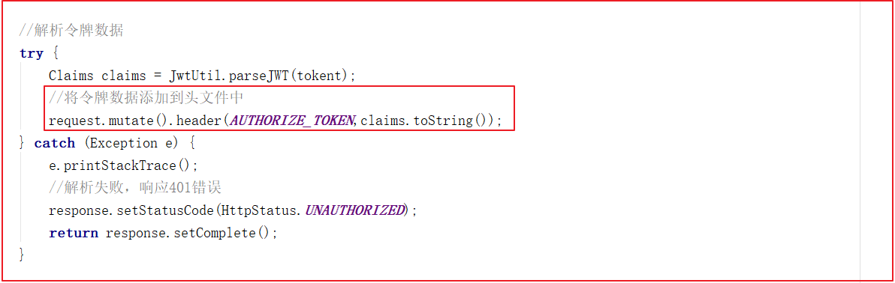
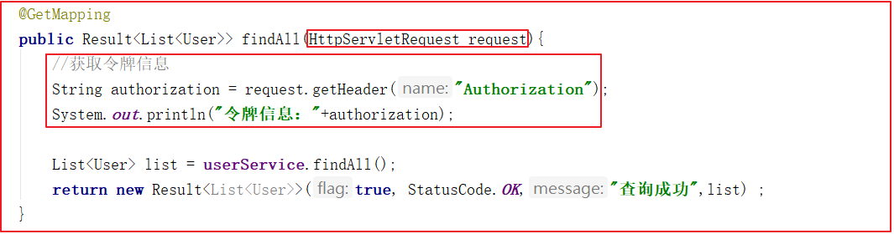
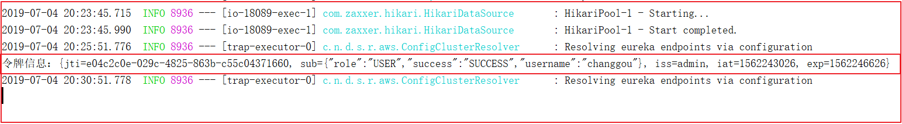

### 4.6 会话保持

用户每次请求的时候，我们都需要获取令牌数据，方法有多重，可以在每次提交的时候，将数据提交到头文件中，也可以将数据存储到Cookie中，每次从Cookie中校验数据，还可以每次将令牌数据以参数的方式提交到网关，这里面采用Cookie的方式比较容易实现。

#### 4.6.1 登录封装Cookie

修改user微服务，每次登录的时候，添加令牌信息到Cookie中，修改changgou-service-user的`com.changgou.user.controller.UserController`的`login`方法，代码如下：

#### 4.6.2 过滤器获取令牌数据

每次在网关中通过过滤器获取Cookie中的令牌，然后对令牌数据进行解析，修改微服务网关changgou-gateway-web中的AuthorizeFilter，代码如下：

登录后测试，可以识别用户身份，不登录无法识别。如下访问`http://localhost:8001/api/user`会携带令牌数据：

#### 4.6.3 添加Header信息

我们还可以在Gateway的全局过滤器中添加请求头信息，例如可以讲令牌信息添加到请求头中，在微服务中获取头信息，如下代码：

修改微服务网关中的AuthorizeFilter过滤器，在令牌信息校验那块将令牌加入到请求头中，如下代码：

在changgou-service-user微服务的UserController的findAll方法中获取请求头测试，代码如下：

后台输出令牌数据如下：

