# day01

## 课程目标

1. 能够理解ElasticSearch的作用（第一章）

2. 能够安装ElasticSearch服务（第二章）

3. 能够理解ElasticSearch的相关概念（第三章）

4. 能够使用java客户端操作ElasticSearch（第四章）

5. 能够理解分词器的作用（第五章）

6. 能够使用ElasticSearch集成IK分词器（第五章）

7. 能够使用restful技术操作操作ElasticSearch（附加）

## 1 ElasticSearch简介

### 1.1 什么是ElasticSearch？

​	ElasticSearch是一个基于Lucene的搜索服务器。它提供了一个分布式多用户能力的全文搜索引擎，基于RESTful web接口。Elasticsearch是用Java开发的，并作为Apache许可条款下的开放源码发布，是当前流行的企业级搜索引擎。设计用于[云计算](https://baike.baidu.com/item/%E4%BA%91%E8%AE%A1%E7%AE%97/9969353)中，能够达到实时搜索，稳定，可靠，快速，安装使用方便。

​	我们建立一个网站或应用程序，并要添加搜索功能，但是想要完成搜索工作的创建是非常困难的。我们希望搜索解决方案要运行速度快，我们希望能有一个零配置和一个完全免费的搜索模式，我们希望能够简单地使用JSON通过HTTP来索引数据，我们希望我们的搜索服务器始终可用，我们希望能够从一台开始并扩展到数百台，我们要实时搜索，我们要简单的多租户，我们希望建立一个云的解决方案。因此我们利用Elasticsearch来解决所有这些问题及可能出现的更多其它问题。

​	ElaticSearch，简称为es， es是一个开源的高扩展的分布式全文检索引擎，它可以近乎实时的存储、检索数据；本身扩展性很好，可以扩展到上百台服务器，处理PB级别的数据。es也使用Java开发并使用Lucene作为其核心来实现所有索引和搜索的功能，但是它的目的是通过简单的RESTful API来隐藏Lucene的复杂性，从而让全文搜索变得简单。

elasticsearch相当于数据库。

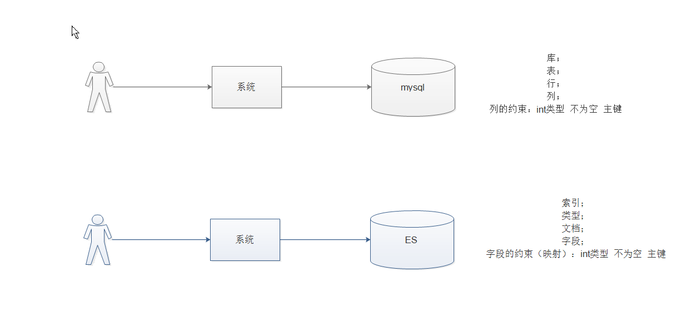


### 1.2 ElasticSearch的使用案例

2013年初，GitHub抛弃了Solr，采取ElasticSearch 来做PB级的搜索。 “GitHub使用ElasticSearch搜索20TB的数据，包括13亿文件和1300亿行代码”

维基百科：启动以elasticsearch为基础的核心搜索架构

SoundCloud：“SoundCloud使用ElasticSearch为1.8亿用户提供即时而精准的音乐搜索服务”

百度：百度目前广泛使用ElasticSearch作为文本数据分析，采集百度所有服务器上的各类指标数据及用户自定义数据，通过对各种数据进行多维分析展示，辅助定位分析实例异常或业务层面异常。目前覆盖百度内部20多个业务线（包括casio、云析分、网盟、预测、文库、直达号、钱包、风控等），单集群最大100台机器，200个ES节点，每天导入30TB+数据

新浪：使用ES 分析处理32亿条实时日志

阿里：使用ES 构建挖财自己的日志采集和分析体系


### 1.3 ElasticSearch对比Solr

Solr 利用 Zookeeper 进行分布式管理，而 Elasticsearch 自身带有分布式协调管理功能;

Solr 支持更多格式的数据，而 Elasticsearch 仅支持json文件格式；

Solr 官方提供的功能更多，而 Elasticsearch 本身更注重于核心功能，高级功能多由第三方插件提供；

Solr 在传统的搜索应用中表现好于 Elasticsearch，但在处理实时搜索应用时效率明显低于 Elasticsearch；

Elasticsearch支持RestFul风格编程（uri的地址，就可以检索），Solr暂不支持；


### 1.4 理解倒排索引

<https://www.gushiwen.org/shiju/shui.aspx>

通常我们搜索某些东西，是通过内容，找词 这样容易区分，这种方式成为正向搜索，那么数据量大就效率低，那么还有一种就是倒排索引方式，可以通过词去找内容，这样速度就非常快了。如下图所示：

文章数据如下：

```
一篇文章1
{
	id:1
	name:"杨慎",
	title:"临江仙·滚滚长江东逝水",
	content:"滚滚长江东逝水，浪花淘尽英雄"
}

一篇文章2
{
	id:2
	name:"苏轼",
	title:"念奴娇·赤壁怀古",
	content:"大江东去，浪淘尽，千古风流人物"
}

一篇文章3
{
	id:3
	name:"柳宗元",
	title:"江雪",
	content:"孤舟蓑笠翁，独钓寒江雪"
}
```

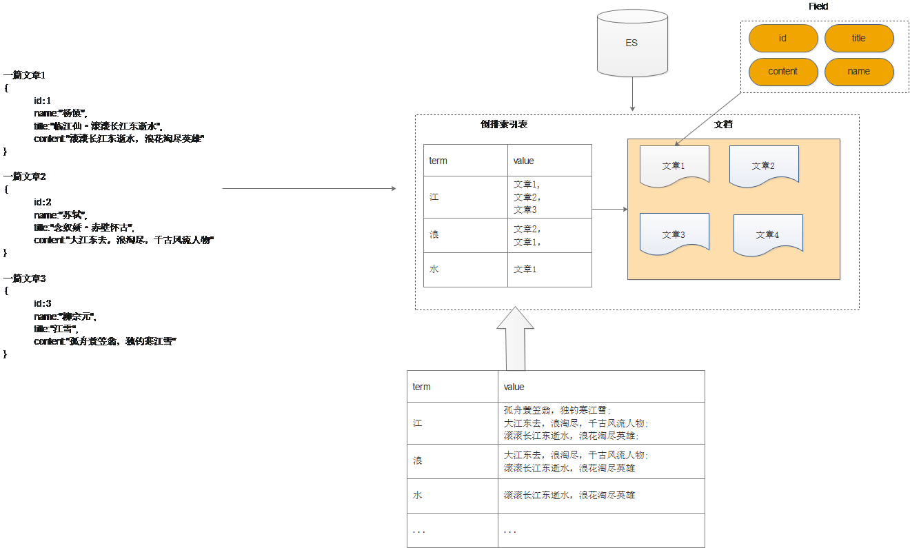


要建立倒排索引表，需要

先对文本进行分词（理解成按照一定规则拆分出词条和值），也就是将词语进行切分然后形成如上的结构和映射关系。比如下边

```properties
临  ---->文章数据
title:江   ---->文章1   解释(title：中分出来江这个词 对应 的有文章1)
content:江 ----->文章1，文章2 解释（content:种分出来讲这个词 对应 有文章1和文章2）
仙
滚
滚
长
江
东
逝
水
```

那么这个过程就是分词，分词的过程需要有分词器来进行。我们有许多的分词器，默认就是标准分词器。


## 2 ElasticSearch安装与启动

### 2.1下载ES压缩包

​	ElasticSearch分为Linux和Window版本，基于我们主要学习的是ElasticSearch的Java客户端的使用，所以我们课程中使用的是安装较为简便的Window版本，项目上线后，公司的运维人员会安装Linux版的ES供我们连接使用。

ElasticSearch的官方地址： <https://www.elastic.co/products/elasticsearch>


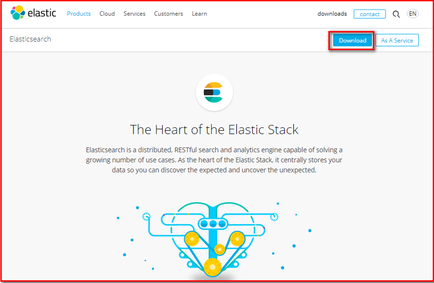


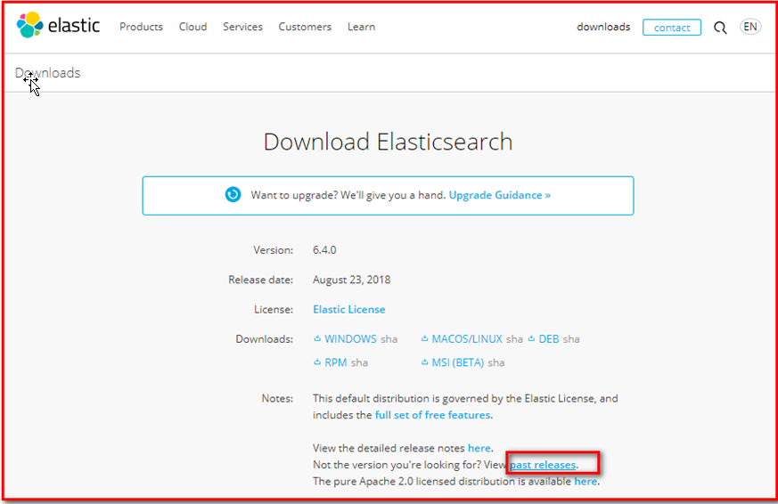


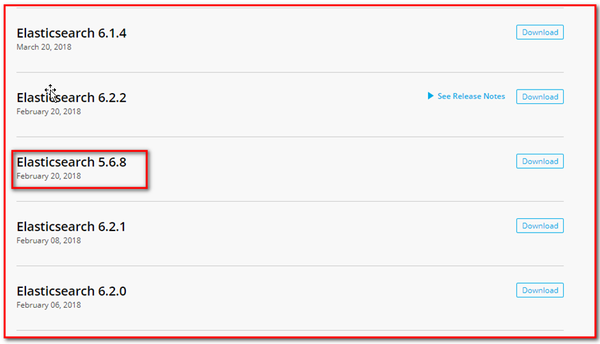


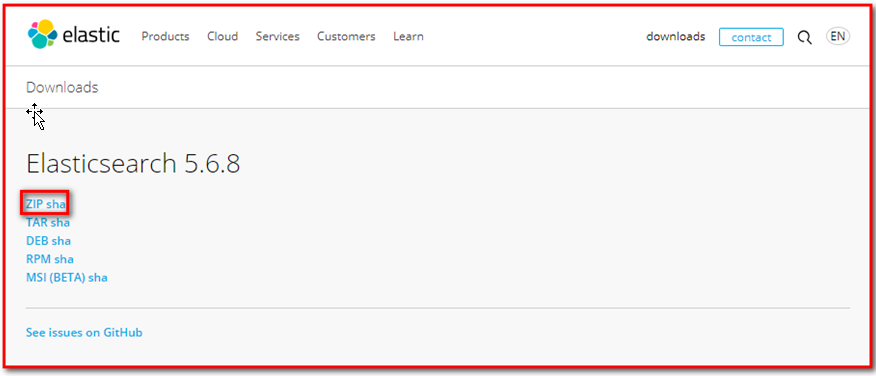


已经下载好了如下图：

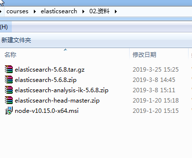

### 2.2 安装ES服务

​	Window版的ElasticSearch的安装很简单，类似Window版的Tomcat，解压开即安装完毕，解压后的ElasticSearch的目录结构如下：


注意：ES的目录不要出现中文，也不要有特殊字符。


### 2.3 启动ES服务

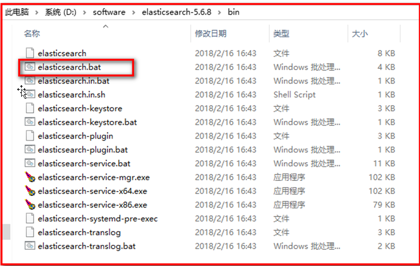


启动：

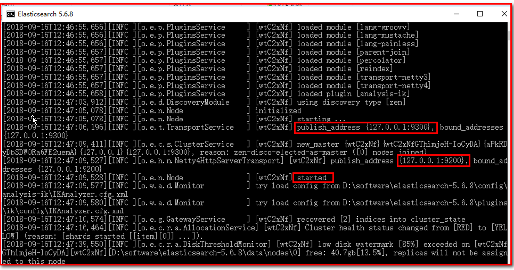

注意：

9300是tcp通讯端口，集群间和TCPClient都执行该端口，可供java程序调用；

9200是http协议的RESTful接口 。

通过浏览器访问ElasticSearch服务器，看到如下返回的json信息，代表服务启动成功：

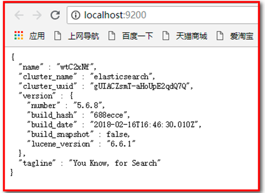

注意事项：

（1）ElasticSearch5是使用java开发的，且本版本的es需要的jdk版本要是1.8以上，所以安装ElasticSearch之前保证JDK1.8+安装完毕，并正确的配置好JDK环境变量，否则启动ElasticSearch失败


（2）出现闪退，通过路径访问发现“空间不足”

修改：解压目录下的/config/jvm.options文件


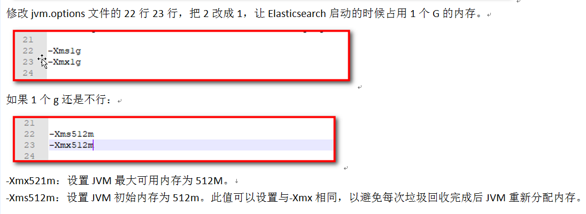

### 2.4 安装ES的图形化界面插件

​	ElasticSearch不同于Solr自带图形化界面，我们可以通过安装ElasticSearch的head插件，完成图形化界面的效果，完成索引数据的查看。

**elasticsearch-5-*以上版本安装head插件，需要先安装 nodejs 以及 grunt** 

#### 2.4.1 安装nodejs

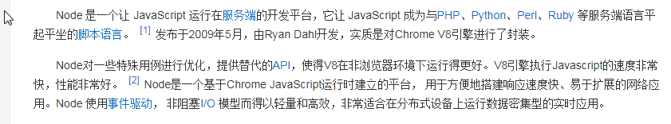

下载nodejs：<https://nodejs.org/en/download/> 

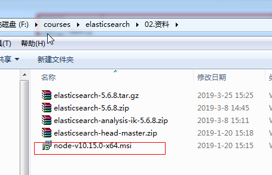

双击如图所示msi文件，下一步即可。安装成功后，执行cmd命令查看版本：

```
node -v
```


安装 grunt:

​	Grunt是基于Node.js的项目构建工具；是基于javaScript上的一个很强大的前端自动化工具，基于NodeJs用于自动化构建、测试、生成文档的项目管理工具,在cmd命令行中执行以下命令：


```shell
npm install -g grunt-cli
```


#### 2.4.2 安装ES head 插件

1）下载head插件：<https://github.com/mobz/elasticsearch-head> 


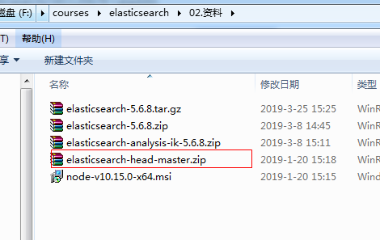


2）解压zip

解压zip包,并在解压目录下执行cmd命令：

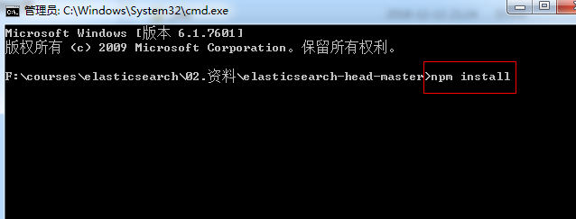

```
npm install
```


执行完成 等待结果：


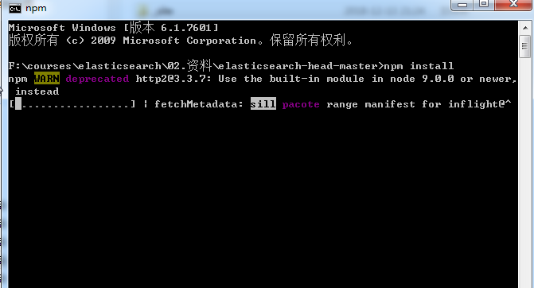

ps:如果安装不成功或者安装速度慢，可以使用淘宝的镜像进行安装：

```shell
npm install -g cnpm –-registry=https://registry.npm.taobao.org
```

后续使用的时候，只需要把npm  xxx   换成  cnpm xxx 即可


#### 2.4.3 配置ES支持head插件

修改elasticsearch/config下的配置文件：elasticsearch.yml，增加以下配置：

```yaml
http.cors.enabled: true
http.cors.allow-origin: "*"
network.host: 127.0.0.1
```

注意有空格:


解释：

```
http.cors.enabled: true：此步为允许elasticsearch跨域访问，默认是false。
http.cors.allow-origin: "*"：表示跨域访问允许的域名地址（*表示任意）。
network.host:127.0.0.1：主机域名
```


#### 2.4.4 访问head插件

1） 重启ES服务器

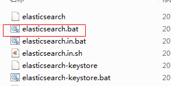

2）进入head插件的目录 执行cmd命令：

```
npm run start
```

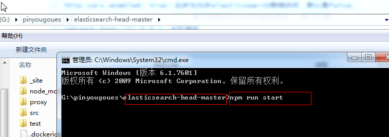

## 3 ElasticSearch相关概念

### 3.1 概述

​	Elasticsearch是面向文档(document oriented)的，这意味着它可以存储整个对象或文档(document)。然而它不仅仅是存储（store），还会索引(index)每个文档的内容使之可以被搜索。在Elasticsearch中，你可以对文档（而非成行成列的数据）进行索引、搜索、排序、过滤。Elasticsearch比较传统关系型数据库如下：

```
Relational DB -> Databases -> Tables -> Rows -> Columns
Elasticsearch -> Indices   -> Types  -> Documents -> Fields
```


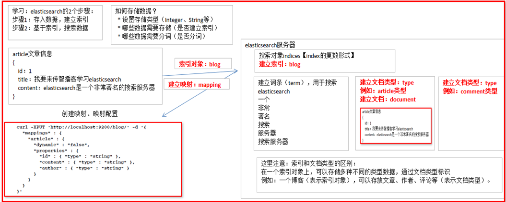


### 3.2 核心概念

#### 3.2.1 索引 index

​	一个索引就是一个拥有几分相似特征的文档的集合。比如说，你可以有一个客户数据的索引，另一个产品目录的索引，还有一个订单数据的索引。一个索引由一个名字来标识（必须全部是小写字母的），并且当我们要对对应于这个索引中的文档进行索引、搜索、更新和删除的时候，都要使用到这个名字。在一个集群中，可以定义任意多的索引。

#### 3.2.2. 类型 type

​	在一个索引中，你可以定义一种或多种类型。一个类型是你的索引的一个逻辑上的分类/分区，其语义完全由你来定。通常，会为具有一组共同字段的文档定义一个类型。比如说，我们假设你运营一个博客平台并且将你所有的数据存储到一个索引中。在这个索引中，你可以为用户数据定义一个类型，为博客数据定义另一个类型，当然，也可以为评论数据定义另一个类型。

#### 3.2.3. 文档 document

​	一个文档是一个可被索引的基础信息单元。比如，你可以拥有某一个客户的文档，某一个产品的一个文档，当然，也可以拥有某个订单的一个文档。文档以JSON（Javascript Object Notation）格式来表示，而JSON是一个到处存在的互联网数据交互格式。

在一个index/type里面，你可以存储任意多的文档。注意，尽管一个文档，物理上存在于一个索引之中，文档必须被索引/赋予一个索引的type。

注意：

```properties
每一篇文档注意在进行创建的时候都会进行打分。用于进行排名，打分的公式实际上用的就是lucece的打分公式。
```


#### 3.2.4. 字段Field

​	相当于是数据表的字段，对文档数据根据不同属性进行的分类标识

#### 3.2.5. 映射 mapping

​	mapping是处理数据的方式和规则方面做一些限制，如某个字段的数据类型、默认值、分词器、是否被索引等等，这些都是映射里面可以设置的，其它就是处理es里面数据的一些使用规则设置也叫做映射，按着最优规则处理数据对性能提高很大，因此才需要建立映射，并且需要思考如何建立映射才能对性能更好。

例如：

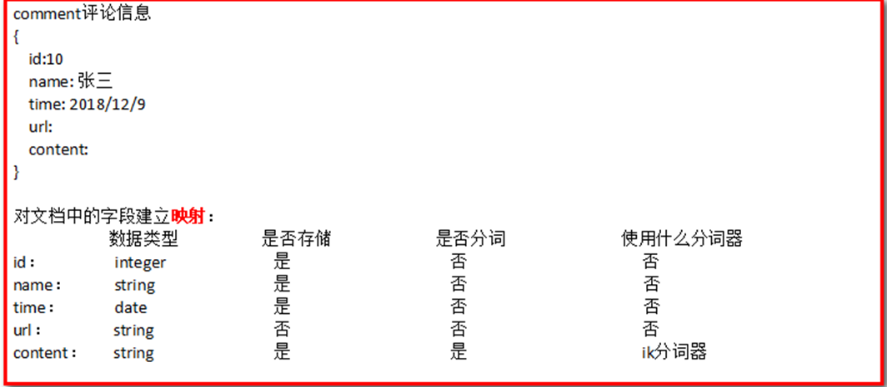


```properties
Field中有四个重要的属性：数据类型，是否分词 是否存储 是否索引. 类似于指定数据库中的表中的列的一些约束，需要根据不同的应用场景来决定使用哪种数据类型和属性值。
+ 数据类型 定义了该Field的数据存储的方式 有基本数据类型 和 字符串类型以及 复杂的数据类型
+ 是否分词 定义了该字段的值是否要被索引。分词的目的就是为了要索引
+ 是否索引 定义了该字段是否要被搜索  要索引的目的就是为了要搜索
+ 是否存储 定义了是否该存储该数据到底层的lucene中.默认是不存储的。存储不存储看页面是否需要展示
```


#### 3.2.6. 接近实时 NRT

​	Elasticsearch是一个接近实时的搜索平台。这意味着，从索引一个文档直到这个文档能够被搜索到有一个轻微的延迟（通常是1秒以内）

#### 3.2.7. 集群 cluster

​	一个集群就是由一个或多个节点组织在一起，它们共同持有整个的数据，并一起提供索引和搜索功能。一个集群由一个唯一的名字标识，这个名字默认就是“elasticsearch”。这个名字是重要的，因为一个节点只能通过指定某个集群的名字，来加入这个集群。

#### 3.2.8. 节点 node

​	一个节点是集群中的一个服务器，作为集群的一部分，它存储数据，参与集群的索引和搜索功能。和集群类似，一个节点也是由一个名字来标识的，默认情况下，这个名字是一个随机的角色的名字，这个名字会在启动的时候赋予节点。这个名字对于管理工作来说挺重要的，因为在这个管理过程中，你会去确定网络中的哪些服务器对应于Elasticsearch集群中的哪些节点。

一个节点可以通过配置集群名称的方式来加入一个指定的集群。默认情况下，每个节点都会被安排加入到一个叫做“elasticsearch”的集群中，这意味着，如果你在你的网络中启动了若干个节点，并假定它们能够相互发现彼此，它们将会自动地形成并加入到一个叫做“elasticsearch”的集群中。

在一个集群里，只要你想，可以拥有任意多个节点。而且，如果当前你的网络中没有运行任何Elasticsearch节点，这时启动一个节点，会默认创建并加入一个叫做“elasticsearch”的集群。

#### 3.2.9. 分片 和 复制 shards & replicas

​	一个索引可以存储超出单个节点硬件限制的大量数据。比如，一个具有10亿文档的索引占据1TB的磁盘空间，而任一节点都没有这样大的磁盘空间；或者单个节点处理搜索请求，响应太慢。为了解决这个问题，Elasticsearch提供了将索引划分成多份的能力，这些份就叫做分片。当你创建一个索引的时候，你可以指定你想要的分片的数量。每个分片本身也是一个功能完善并且独立的“索引”，这个“索引”可以被放置到集群中的任何节点上。分片很重要，主要有两方面的原因： 1）允许你水平分割/扩展你的内容容量。 2）允许你在分片（潜在地，位于多个节点上）之上进行分布式的、并行的操作，进而提高性能/吞吐量。

至于一个分片怎样分布，它的文档怎样聚合回搜索请求，是完全由Elasticsearch管理的，对于作为用户的你来说，这些都是透明的。

在一个网络/云的环境里，失败随时都可能发生，在某个分片/节点不知怎么的就处于离线状态，或者由于任何原因消失了，这种情况下，有一个故障转移机制是非常有用并且是强烈推荐的。为此目的，Elasticsearch允许你创建分片的一份或多份拷贝，这些拷贝叫做复制分片，或者直接叫复制。

（后面大家自己看即可）

复制之所以重要，有两个主要原因： 在分片/节点失败的情况下，提供了高可用性。因为这个原因，注意到复制分片从不与原/主要（original/primary）分片置于同一节点上是非常重要的。扩展你的搜索量/吞吐量，因为搜索可以在所有的复制上并行运行。总之，每个索引可以被分成多个分片。一个索引也可以被复制0次（意思是没有复制）或多次。一旦复制了，每个索引就有了主分片（作为复制源的原来的分片）和复制分片（主分片的拷贝）之别。分片和复制的数量可以在索引创建的时候指定。在索引创建之后，你可以在任何时候动态地改变复制的数量，但是你事后不能改变分片的数量。

默认情况下，Elasticsearch中的每个索引被分片5个主分片和1个复制，这意味着，如果你的集群中至少有两个节点，你的索引将会有5个主分片和另外5个复制分片（1个完全拷贝），这样的话每个索引总共就有10个分片。

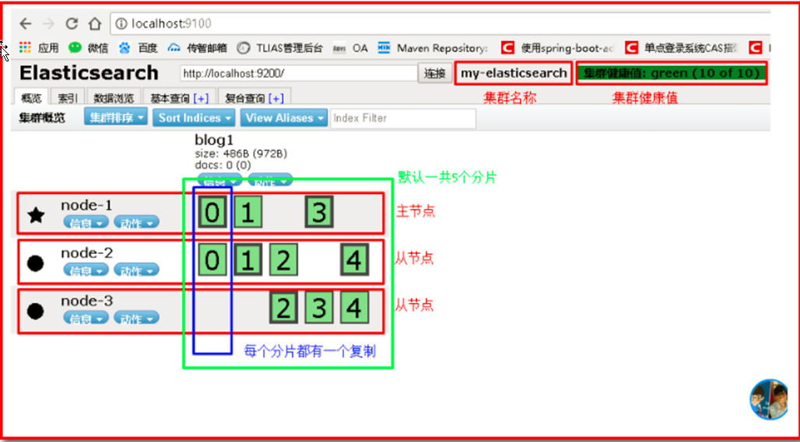


## 4. 操作ElasticSearch

操作ES就相当于对操作数据库，我们应该知道针对数据库我们有不同的CRUD功能，那么同样的道理，操作elasticsearch也能有CRUD功能，只不过叫法不一样。有两种方式:如下：

+ 使用Elasticsearch提供的restfull风格的API实现操作ES （查看另外一个world文档）
+ 使用elasticsearch提供的java Client API来实现操作ES 又有许多方式，我们这里主要使用springboot集成spring data elasticsearch来实现
  + java API 使用官方提供的TransportClient(暂时演示使用官方)
  + java API 使用 REST clients
  + java api 使用  Jest
  + java api 使用 spring data elasticsearch（后续推荐使用）

### 4.1 搭建ElasticSearch操作环境 

#### 4.1.1 创建springboot工程

创建一个springboot工程,注意添加springboot 的spring data elasticsearch的起步依赖，我们使用该起步依赖中的transport-elasticsearch的官方的API

#### 4.1.2 pom.xml

```xml
<?xml version="1.0" encoding="UTF-8"?>
<project xmlns="http://maven.apache.org/POM/4.0.0"
         xmlns:xsi="http://www.w3.org/2001/XMLSchema-instance"
         xsi:schemaLocation="http://maven.apache.org/POM/4.0.0 http://maven.apache.org/xsd/maven-4.0.0.xsd">
    <modelVersion>4.0.0</modelVersion>

    <groupId>com.itheima</groupId>
    <artifactId>itheima-springboot-es</artifactId>
    <version>1.0-SNAPSHOT</version>
    <parent>
        <groupId>org.springframework.boot</groupId>
        <artifactId>spring-boot-starter-parent</artifactId>
        <version>2.1.4.RELEASE</version>
    </parent>

    <dependencies>
        <dependency>
            <groupId>org.springframework.boot</groupId>
            <artifactId>spring-boot-starter-web</artifactId>
        </dependency>
        <dependency>
            <groupId>org.springframework.boot</groupId>
            <artifactId>spring-boot-starter-data-elasticsearch</artifactId>
        </dependency>
        <dependency>
            <groupId>org.springframework.boot</groupId>
            <artifactId>spring-boot-starter-test</artifactId>
            <scope>test</scope>
        </dependency>
    </dependencies>
</project>
```

#### 4.1.3 创建启动类和配置连接服务器地址

在com.itheima下创建启动类：

```java
@SpringBootApplication
public class ESApplication {
    public static void main(String[] args) {
        SpringApplication.run(ESApplication.class, args);
    }
}
```


创建yml文件：

```yaml
server:
  port: 8080
spring:
  data:
    elasticsearch:
      cluster-nodes: 127.0.0.1:9300
      cluster-name: elasticsearch
```


### 4.2 操作ElasticSearch

#### 4.2.1 新建索引+添加文档

使用创建索引+自动创建映射（Elasticsearch帮助我们自动建立映射，后续讲完分词器后，手动建立映射）

（1）创建POJO 用于存储数据转成JSON

```java
public class Article implements Serializable {
    private Long id;
    private String content;
    private String title;

    public Long getId() {
        return id;
    }

    public void setId(Long id) {
        this.id = id;
    }

    public String getContent() {
        return content;
    }

    public void setContent(String content) {
        this.content = content;
    }

    public String getTitle() {
        return title;
    }

    public void setTitle(String title) {
        this.title = title;
    }
}
```


（2）创建测试类并完成创建索引和添加文档（自动添加映射）com.itheima下创建测试类 

```java
@SpringBootTest
@RunWith(SpringRunner.class)
public class EsApplicationTest01 {

    @Autowired
    private TransportClient transportClient;

    @Autowired
    private ObjectMapper objectMapper;

    //创建索引 并 添加文档  增加   //修改文档
    @Test
    public void createIndexAndDocument() throws Exception {
        //设置数据
        Article article = new Article();
        article.setTitle("华为手机很棒");
        article.setContent("华为手机真的很棒");
        article.setId(1L);

        IndexResponse indexResponse = transportClient
                .prepareIndex("blog01", "article", "1")
                .setSource(objectMapper.writeValueAsString(article), XContentType.JSON)
                .get();
        System.out.println(indexResponse);
    }
}
```

#### 4.2.2 根据ID查询文档

```java
    //根据Id获取数据
    @Test
    public void getById() {
        GetResponse documentFields = transportClient.prepareGet("blog01", "article", "1").get();
        System.out.println(documentFields.getSourceAsString());
    }
```


#### 4.2.3 根据ID删除文档

```java

//删除文档
@Test
public void deleteById() {
    transportClient.prepareDelete("blog01", "article", "1");
}

```


## 5 分词器和ElasticSearch集成使用

### 5.1 分词器

我们刚才在进行说明倒排索引的时候说过，在进行数据存储的时候，需要先进行分词。而分词指的就是按照一定的规则将词一个个切割。这个规则是有内部的分词器机制来决定的，不同的分词器就是不同的规则

+ standard分词器
+ ik分词器
+ stop分词器
+ 其他的分词器

```properties
以上：在说明这个情况的时候我们应该知道在默认的情况下ES提供了英文相关的分词器默认为standard分词器
对于中文分词不是特别的好。所以我们需要用到中文相关的分词器，那么IK分词器就是其中的佼佼者
```

分词的过程比较复杂，不同的分词器就有不同的规则，例如：

```properties
如有一段文本：Lucene is a full-text search java 

使用标准分词器：
	浏览器地址输入：http://localhost:9200/_analyze?analyzer=standard&text=Lucene is a full-text search java

最终形成词汇为：
Lucene 
is 
a 
full 
text 
search 
java

使用停用分词器：
	浏览器地址输入：http://localhost:9200/_analyze?analyzer=stop&text=Lucene is a full-text search java

最终形成词汇为：
lucene 
full 
text 
search 
java
```


### 5.2 IK分词器

#### 5.2.1 什么是IK分词器

以上针对英文可以，但是如果使用中文的话，分词效果不好，

IK分词是一款国人开发的相对简单的中文分词器。虽然开发者自2012年之后就不在维护了，但在工程应用中IK算是比较流行的一款！

特点： 

 	1. 能将原本不是词的变成一个词 
		2. 分词效果优秀 
		3. 能将原本是一个词的进行停用，这些词我们称为停用词。停用词：单独运用没有具体语言意义的词汇，可根据语义自己定义。

#### 5.2.2 IK分词器安装

下载地址：

```
https://github.com/medcl/elasticsearch-analysis-ik/releases
```

 我们已经提供：

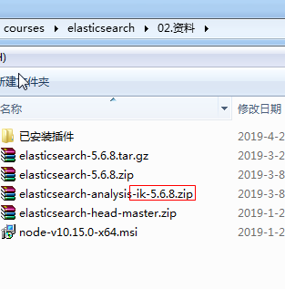


- 先将其解压，将解压后的elasticsearch文件夹重命名文件夹为ik
- 将ik文件夹拷贝到elasticsearch/plugins 目录下。
- 重新启动，即可加载IK分词器 

#### 5.2.3 IK分词器测试

IK提供了两个分词算法ik_smart 和 ik_max_word. 其中 ik_smart 为最少切分(智能切分)，ik_max_word为最细粒度划分 

+ 第一种：最小切分
+ 第二种：种最细切分

测试第一种：浏览器中输入：

```
http://127.0.0.1:9200/_analyze?analyzer=ik_smart&pretty=true&text=我是程序员
```


测试第二种：浏览器输入：

```
http://127.0.0.1:9200/_analyze?analyzer=ik_max_word&pretty=true&text=我是程序员
```


#### 5.2.4 自定义词库/词典

##### 5.2.4.1  测试分词效果

（1）我们现在测试"传智播客"，

浏览器的测试效果如下  http://127.0.0.1:9200/_analyze?analyzer=ik_smart&pretty=true&text=传智播客 

```json
{
  "tokens" : [
    {
      "token" : "传",
      "start_offset" : 0,
      "end_offset" : 1,
      "type" : "CN_CHAR",
      "position" : 0
    },
    {
      "token" : "智",
      "start_offset" : 1,
      "end_offset" : 2,
      "type" : "CN_CHAR",
      "position" : 1
    },
    {
      "token" : "播",
      "start_offset" : 2,
      "end_offset" : 3,
      "type" : "CN_CHAR",
      "position" : 2
    },
    {
      "token" : "客",
      "start_offset" : 3,
      "end_offset" : 4,
      "type" : "CN_CHAR",
      "position" : 3
    }
  ]
}
```

（2）再测试：

```properties
http://127.0.0.1:9200/_analyze?analyzer=ik_smart&pretty=true&text=lucene is a full-text java 中国啊伟大的祖国
```


```json
{
    "tokens": [
        {
            "token": "lucene",
            "start_offset": 0,
            "end_offset": 6,
            "type": "ENGLISH",
            "position": 0
        },
        {
            "token": "a",
            "start_offset": 10,
            "end_offset": 11,
            "type": "ENGLISH",
            "position": 1
        },
        {
            "token": "full-text",
            "start_offset": 12,
            "end_offset": 21,
            "type": "LETTER",
            "position": 2
        },
        {
            "token": "java",
            "start_offset": 22,
            "end_offset": 26,
            "type": "ENGLISH",
            "position": 3
        },
        {
            "token": "中国",
            "start_offset": 27,
            "end_offset": 29,
            "type": "CN_WORD",
            "position": 4
        },
        {
            "token": "啊",
            "start_offset": 29,
            "end_offset": 30,
            "type": "CN_CHAR",
            "position": 5
        },
        {
            "token": "伟大",
            "start_offset": 30,
            "end_offset": 32,
            "type": "CN_WORD",
            "position": 6
        },
        {
            "token": "祖国",
            "start_offset": 33,
            "end_offset": 35,
            "type": "CN_WORD",
            "position": 7
        }
    ]
}
```


##### 5.2.4.2 添加自定义词库/词典


（1）通过测试1发现，传智播客没有作为整体被分词出来。我们需要将其扩展为一个词，此时我们需要自定义扩展词典

- 进入elasticsearch/plugins/ik/config目录 
- 新建一个my.dic文件（文件名任意），**特别注意**编辑内容(以utf8无bom保存, 如果不行加一些换行)

```properties
传智播客
```

+ 修改IKAnalyzer.cfg.xml（在ik/config目录下） 

```xml
<properties>
    <comment>IK Analyzer 扩展配置</comment>
    <!‐‐用户可以在这里配置自己的扩展字典 ‐‐>
    <entry key="ext_dict">my.dic</entry>
    <!‐‐用户可以在这里配置自己的扩展停止词字典‐‐>
    <entry key="ext_stopwords"></entry>
</properties>
```


（2）测试二我们发现有些词我们需要分出来，比如 “啊”

+ 如果需要停用一些词，比如有些文本在进行创建文档建立倒排索引的时候需要过滤掉一些没有用的词，则可以进行自定义词典：我们把他叫做**停用词典**

（1）进入elasticsearch/plugins/ik/config目录 

（2）创建一个stopwords.dic 文件，特别注意：编辑内容(以utf8无bom保存, 如果不行加一些换行)

（3）在文件中添加一个字为：的 

（4)修改IKAnalyzer.cfg.xml（在ik/config目录下） 

```properties
<properties>
    <comment>IK Analyzer 扩展配置</comment>
    <!‐‐用户可以在这里配置自己的扩展字典 ‐‐>
    <entry key="ext_dict">my.dic</entry>
    <!‐‐用户可以在这里配置自己的扩展停止词字典‐‐>
    <entry key="ext_stopwords">stopwords.dic</entry>
</properties>
```

（5）重启eslasticesarch服务器查看效果浏览器中输入：

```properties
http://127.0.0.1:9200/_analyze?analyzer=ik_smart&pretty=true&text=我是传智播客的学生 
```

查看分词效果：并没有出现的，说明这个词已经被过滤掉了。

```json
{
    "tokens": [
        {
            "token": "我",
            "start_offset": 0,
            "end_offset": 1,
            "type": "CN_CHAR",
            "position": 0
        },
        {
            "token": "是",
            "start_offset": 1,
            "end_offset": 2,
            "type": "CN_CHAR",
            "position": 1
        },
        {
            "token": "传智播客",
            "start_offset": 2,
            "end_offset": 6,
            "type": "CN_WORD",
            "position": 2
        },
        {
            "token": "学生",
            "start_offset": 7,
            "end_offset": 9,
            "type": "CN_WORD",
            "position": 3
        }
    ]
}
```

