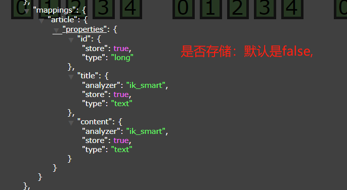
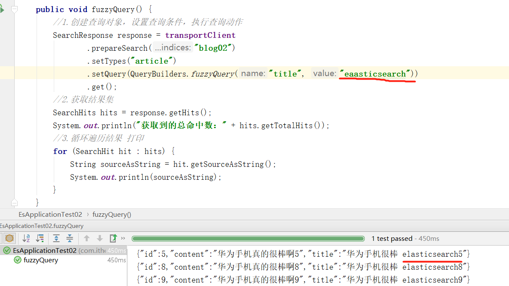
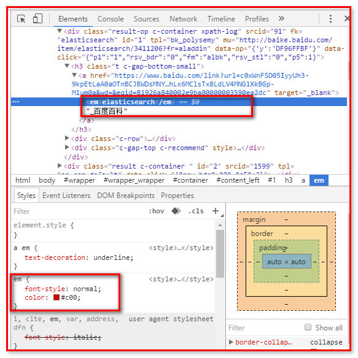
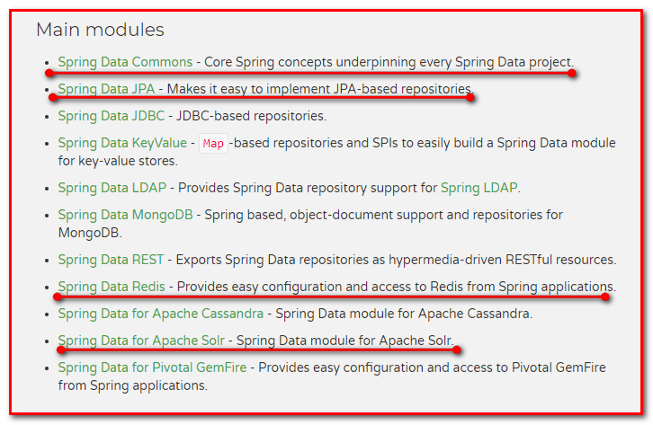
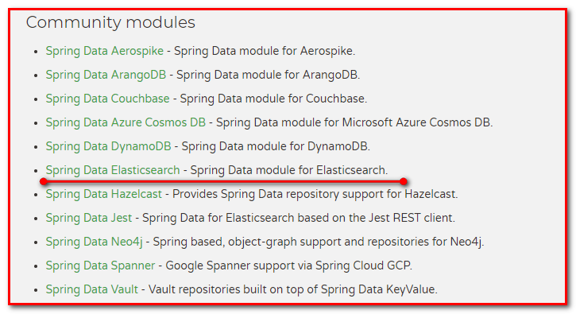
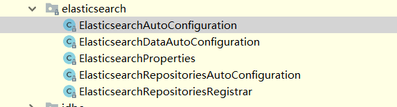

# day02_ES

## 学习目标

1. 能够完成创建索引的操作
2. 能够完成删除索引的操作
3. 能够完成创建映射的操作
4. 能够完成文档的增删改查
5. 能够完成文档的分页操作
6. 能够完成文档的高亮查询操作
7. 能够搭建Spring Data ElasticSearch的环境
8. 能够完成Spring Data ElasticSearch的基本增删改查操作
9. 能够掌握基本条件查询的方法命名规则 

## 第一章ElasticSearch常用编程操作 

### 1.索引相关操作 

为了方便，我们就在上一天的课程中的项目中来使用即可，创建一个测试类用作今天的测试

```java
@SpringBootTest
@RunWith(SpringRunner.class)
public class EsApplicationTest03 {
    @Autowired
    private ElasticsearchTemplate elasticsearchTemplate;

    @Autowired
    private ArticleDao dao;
}
```


#### 1.1创建索引

```java
  @Test
    public void createIndex() {
        //准备创建索引 ，指定索引名 执行创建的动作（get方法）
        transportClient.admin().indices().prepareCreate("blog03").get();
    }
```

#### 1.2删除索引

```java
  //删除索引
    @Test
    public void deleteIndex() {
        //准备删除索引 ，指定索引名 指定删除的动作（get）
        transportClient.admin().indices().prepareDelete("blog02").get();
    }
```

### 2.映射相关操作

#### 2.1映射格式

```json
"mappings" : {
    "article" : {
        "properties" : {
            "id" : { "type" : "long","store":"true" },
            "title" : { "type" : "text","analyzer":"ik_smart","index":"true","store":"true" },
            "content" : { "type" : "text","analyzer":"ik_smart","index":"true","store":"true" }
        }
    }
}
```


#### 2.2创建映射

```java
@Test
public void putMapping() throws Exception {
    //1.创建索引 如果已有索引 可以先删除再测试
    transportClient.admin().indices().prepareCreate("blog02").get();

    //2.创建映射
    XContentBuilder builder = XContentFactory.jsonBuilder()
        .startObject()
        .startObject("article")
        .startObject("properties")
        .startObject("id")
        .field("type", "long").field("store", "true")
        .endObject()
        .startObject("title")
        .field("type", "text").field("analyzer", "ik_smart").field("store", "true")
        .endObject()
        .startObject("content")
        .field("type", "text").field("analyzer", "ik_smart").field("store", "true")
        .endObject()
        .endObject()
        .endObject()
        .endObject();

    PutMappingRequest mapping = new PutMappingRequest("blog02").type("article").source(builder);

    transportClient.admin().indices().putMapping(mapping).get();
}
```




### 3.文档相关操作 

#### 3.1创建文档

##### 3.1.1通过ObjctMapper进行创建

```java
//创建文档 /更新文档 使用的是ik分词器
@Test
public void createIndexAndDocument() throws Exception {
    //设置数据
    Article article = new Article();
    article.setTitle("华为手机很棒");
    article.setContent("华为手机真的很棒");
    article.setId(1L);
    IndexResponse indexResponse = transportClient
        .prepareIndex("blog02", "article", "1")
        .setSource(objectMapper.writeValueAsString(article), XContentType.JSON)
        .get();
    System.out.println(indexResponse);
}
```


##### 3.1.2使用xcontentBuidler方式进行创建

+ 提供JSON如下

```json
{
    "id": 1,
    "content": "华为手机真的很棒",
    "title": "华为手机很棒"
}
```

+ 实现创建文档

```java
//创建使用JSON xcontentbuilder的方式来创建文档

/**
     *
     * {
         "id": 1,
         "content": "华为手机真的很棒",
         "title": "华为手机很棒"
     }
     *
     * @throws Exception
     */
@Test
public void createDocumentByJsons() throws Exception{
    XContentBuilder xContentBuilder = XContentFactory.jsonBuilder()
        .startObject()
        .field("id",2)
        .field("content","华为手机真的很棒你猜猜")
        .field("title","华为手机很棒但是我现在真的忧桑")
        .endObject();
    IndexResponse indexResponse = transportClient.prepareIndex("blog02", "article", "2").setSource(xContentBuilder).get();
    System.out.println(indexResponse);
}
```


#### 3.2修改文档 

**注意**

修改文档和新增文档一样。当存在相同的文档的唯一ID的时候，便是更新。


#### 3.3删除文档

```java
//删除文档
@Test
public void deleteByDocument() {
    transportClient.prepareDelete("blog02", "article", "2").get();
}
```


#### 3.4查询文档 

##### 3.4.1墙裂推荐批量添加文档数据

批量添加数据，我们可能想到的是直接循环，然后每个循环里面去提交，但是这样的话，效率很低。我们采用批量添加的方式，一次性提交数据。

```java
//批量添加文档

@Test
public void createDocument() throws Exception {
    //构建批量添加builder
    BulkRequestBuilder bulkRequestBuilder = transportClient.prepareBulk();
    long start = System.currentTimeMillis();
    for (long i = 0; i < 100; i++) {
        //数据构建
        Article article = new Article();
        article.setTitle("华为手机很棒" + i);
        article.setContent("华为手机真的很棒啊" + i);
        article.setId(i);
        //转成JSON
        String valueAsString = objectMapper.writeValueAsString(article);
        //设置值
        IndexRequest indexRequest = new IndexRequest("blog02", "article", "" + i).source(valueAsString, XContentType.JSON);
        //添加请求对象buidler中
        bulkRequestBuilder.add(indexRequest);
    }
    //一次性提交
    BulkResponse bulkItemResponses = bulkRequestBuilder.get();

    long end = System.currentTimeMillis();
    System.out.println("消耗了:"+(end-start)/1000);


    System.out.println("获取状态：" + bulkItemResponses.status());
    if (bulkItemResponses.hasFailures()) {
        System.out.println("还有些--->有错误");
    }

}
```

测试结果为：


测是结果是2S秒钟就可以操作3000W条数据。


##### 3.4.2文档的查询

+  查询所有数据


```java
//查询所有

@Test
public void matchAllQuery() {
    //1.创建查询对象，设置查询条件，执行查询动作
    SearchResponse response = transportClient
        .prepareSearch("blog02")
        .setTypes("article")
        .setQuery(QueryBuilders.matchAllQuery())
        .get();
    //2.获取结果集
    SearchHits hits = response.getHits();
    System.out.println("获取到的总命中数：" + hits.getTotalHits());
    //3.循环遍历结果 打印
    for (SearchHit hit : hits) {
        String sourceAsString = hit.getSourceAsString();
        System.out.println(sourceAsString);
    }
}
```

+ queryStringQuery():字符串查询

注意:

```properties
使用它是先分词再进行查询的，而且默认不指定字段时，是使用默认的分词器default_field和defaul anlzyer来进行查询，如果指定了字段，则使用之前的映射设置的分词器来进行分词，当然也可以指定分词器
```


```java
//如果不写任何查询字段，那么会默认使用默认的分词器进行分词查询。用的是standard的标准分词器 进行查询default_field default_analyzer
// https://blog.csdn.net/u013795975/article/details/81102010
//如果指定了某一个字段，则会使用之前映射中指定的分词器进行查询。
//注意 他只能查询字符串类型数据,如果不指定字段，则会查询所有的字段的值
@Test
public void queryStringQuery() {
    //1.创建查询对象，设置查询条件，执行查询动作
    SearchResponse response = transportClient
        .prepareSearch("blog02")
        .setTypes("article")
        .setQuery(QueryBuilders.queryStringQuery("手机").field("title"))
        .get();
    //2.获取结果集
    SearchHits hits = response.getHits();
    System.out.println("获取到的总命中数：" + hits.getTotalHits());
    //3.循环遍历结果 打印
    for (SearchHit hit : hits) {
        String sourceAsString = hit.getSourceAsString();
        System.out.println(sourceAsString);
    }
}
```

+ termQuery词条查询


```properties
Term 翻译成词条。这个我们称为词条查询
查询时，不分词，将其作为整体作为条件去倒排索引中匹配是否存在。 简述为：不分词，整体匹配查询
```


```java
//查询时，不分词，将其作为整体作为条件去倒排索引中匹配是否存在。 简述为：不分词，整体匹配查询
@Test
public void termQuery() {
    //1.创建查询对象，设置查询条件，执行查询动作
    SearchResponse response = transportClient
        .prepareSearch("blog02")
        .setTypes("article")
        .setQuery(QueryBuilders.termQuery("title", "手机"))
        .get();
    //2.获取结果集
    SearchHits hits = response.getHits();
    System.out.println("获取到的总命中数：" + hits.getTotalHits());
    //3.循环遍历结果 打印
    for (SearchHit hit : hits) {
        String sourceAsString = hit.getSourceAsString();
        System.out.println(sourceAsString);
    }
}
```

+ matchQuery

特点：先分词，再查询，可以指定任意数据类型。需要只当要查询的哪个字段

```java
//匹配查询
//特点： 查询时，先进行分词，并分词之后再进行匹配查询将结果合并返回出来。它可以指定非字符串的查询，数字的都可以。简述为：先分词，再查询，可以指定任意数据类型
@Test
public void matchQuery() {
    //1.创建查询对象，设置查询条件，执行查询动作
    SearchResponse response = transportClient
        .prepareSearch("blog02")
        .setTypes("article")
        .setQuery(QueryBuilders.matchQuery("title","华为手机真的很棒啊9"))
        .get();
    //2.获取结果集
    SearchHits hits = response.getHits();
    System.out.println("获取到的总命中数：" + hits.getTotalHits());
    //3.循环遍历结果 打印
    for (SearchHit hit : hits) {
        String sourceAsString = hit.getSourceAsString();
        System.out.println(sourceAsString);
    }
}
```


+ wildcardQuery():模糊查询

```java
 //模糊搜索: 也叫通配符搜索
    //? 表示任意字符 一定占用一个字符空间，相当于占位符
    //* 表示任意字符 可以占用也可以不占用

    @Test
    public void wildcardQuery() {
        //1.创建查询对象，设置查询条件，执行查询动作
        SearchResponse response = transportClient
                .prepareSearch("blog02")
                .setTypes("article")
                .setQuery(QueryBuilders.wildcardQuery("title", "手?"))
                .get();
        //2.获取结果集
        SearchHits hits = response.getHits();
        System.out.println("获取到的总命中数：" + hits.getTotalHits());
        //3.循环遍历结果 打印
        for (SearchHit hit : hits) {
            String sourceAsString = hit.getSourceAsString();
            System.out.println(sourceAsString);
        }
    }
```

+ 相似度查询fuzzyQuery()

```java
//相似度查询 输入错误的单词也能搜索出来
//
@Test
public void fuzzyQuery() {
    //1.创建查询对象，设置查询条件，执行查询动作
    SearchResponse response = transportClient
        .prepareSearch("blog02")
        .setTypes("article")
        .setQuery(QueryBuilders.fuzzyQuery("title", "eaasticsearch"))
        .get();
    //2.获取结果集
    SearchHits hits = response.getHits();
    System.out.println("获取到的总命中数：" + hits.getTotalHits());
    //3.循环遍历结果 打印
    for (SearchHit hit : hits) {
        String sourceAsString = hit.getSourceAsString();
        System.out.println(sourceAsString);
    }
}
```





+ 范围查询rangeQuery()

```java
/**
     *  范围查询:如下代码 查询id 从0 到20之间的数据包含0 和20
     *  from  to
     *  gt lt
     */
@Test
public void rangeQuery() {
    //1.创建查询对象，设置查询条件，执行查询动作
    SearchResponse response = transportClient
        .prepareSearch("blog02")
        .setTypes("article")
        .setQuery(QueryBuilders.rangeQuery("id").from(0,true).to(20,true))
        .get();
    //2.获取结果集
    SearchHits hits = response.getHits();
    System.out.println("获取到的总命中数：" + hits.getTotalHits());
    //3.循环遍历结果 打印
    for (SearchHit hit : hits) {
        String sourceAsString = hit.getSourceAsString();
        System.out.println(sourceAsString);
    }
}
```


##### 3.4.3布尔查询boolQuery

###### 3.4.3.1介绍

bool查询 也叫做多条件组合查询，指在搜索过程中我们可以指定多种条件进行查询，例如：在JD我想买手机并且价格在500-2000之间的并且是苹果这个品牌的手机等等。那么这里面就需要多种条件组合在一起再执行查询。

当然执行查询的条件不一定是 都要满足，有可能是或者的关系，有可能是并且的关系，也有可能是非的关系。

Elasticsearch中定义了以下几种条件满足关系：

```properties

//MUST  必须满足条件   相当于AND
//MUST_NOT 必须不满足条件  相当于 NOT
//SHOULD  应该满足条件   相当于OR
//FILTER  必须满足条件  区别于MUST 它在查询上下文中查询
```


###### 3.4.3.2代码实现

需求：

​	查询title为手机的，并且id在0-30之间的数据。

代码：

```java
//多条件组合查询
//需求： 查询title为手机的，并且id在0-30之间的数据
//MUST  必须满足条件   相当于AND
//MUST_NOT 必须不满足条件  相当于 NOT
//SHOULD  应该满足条件   相当于OR
//FILTER  必须满足条件  区别于MUST 它在查询上下文中查询
@Test
public void boolquery() {
    //1.创建组合条件对象
    BoolQueryBuilder boolQueryBuilder = QueryBuilders.boolQuery();
    //2.创建条件1 和条件2 将这两个条件组合在一起
    RangeQueryBuilder rangeQueryBuilder = QueryBuilders.rangeQuery("id").from(0, true).to(30, true);
    TermQueryBuilder termQueryBuilder = QueryBuilders.termQuery("title", "手机");
    boolQueryBuilder
        .must(rangeQueryBuilder)
        .must(termQueryBuilder);
    //3.创建查询对象，设置查询条件，执行查询动作
    SearchResponse response = transportClient
        .prepareSearch("blog02")
        .setTypes("article")
        .setQuery(boolQueryBuilder)
        .get();
    //4.获取结果集
    SearchHits hits = response.getHits();
    System.out.println("获取到的总命中数：" + hits.getTotalHits());
    //5.循环遍历结果 打印
    for (SearchHit hit : hits) {
        String sourceAsString = hit.getSourceAsString();
        System.out.println(sourceAsString);
    }
}
```


##### 3.4.5过虑器 

​	过虑是针对搜索的结果进行过虑，过虑器主要判断的是文档是否匹配，不去计算和判断文档的匹配度得分，所以过虑器性能比查询要高，且方便缓存，推荐尽量使用过虑器去实现查询或者过虑器和查询共同使用。

MUST和FILTER的区别：

```properties
MUST 必须满足某条件，但是需要查询和计算文档的匹配度的分数,还要排序,速度要慢 
FILTER 必须满足某条件,但是不需要计算匹配度分数，那么优化查询效率，方便缓存。
```


如下使用了filter


```java
@Test
    public void boolquery() {
        //1.创建组合条件对象
        BoolQueryBuilder boolQueryBuilder = QueryBuilders.boolQuery();
        //2.创建条件1 和条件2 将这两个条件组合在一起
        RangeQueryBuilder rangeQueryBuilder = QueryBuilders.rangeQuery("id").from(0, true).to(30, true);
        TermQueryBuilder termQueryBuilder = QueryBuilders.termQuery("title", "手机");
        boolQueryBuilder
                .filter(rangeQueryBuilder)
                .filter(termQueryBuilder);
        //3.创建查询对象，设置查询条件，执行查询动作
        SearchResponse response = transportClient
                .prepareSearch("blog02")
                .setTypes("article")
                .setQuery(boolQueryBuilder)
                .get();
        //4.获取结果集
        SearchHits hits = response.getHits();
        System.out.println("获取到的总命中数：" + hits.getTotalHits());
        //5.循环遍历结果 打印
        for (SearchHit hit : hits) {
            String sourceAsString = hit.getSourceAsString();
            System.out.println(sourceAsString);
        }
    }
```


##### 3.4.6分页查询和排序 

+ ES支持分页查询，传入两个参数：from和size。

  form：表示起始文档的下标，从0开始。
  size：查询的文档数量。 

+ 可以在字段上添加一个或多个排序，支持在keyword、date、float等类型上添加，text类型的字段上默认是不允许添加排序。 

```java
//排序和分页 每页显示2行记录
//按照Id升序排列
@Test
public void pageAndSort() {
    //1.创建查询对象，设置查询条件，执行查询动作
    SearchResponse response = transportClient
        .prepareSearch("blog02")
        .setTypes("article")
        .setQuery(QueryBuilders.termQuery("title", "手机"))
        .setFrom(0)// (page -1)* rows
        .setSize(2)//rows
        .addSort("id", SortOrder.ASC)//升序
        .get();
    //2.获取结果集
    SearchHits hits = response.getHits();
    System.out.println("获取到的总命中数：" + hits.getTotalHits());
    //3.循环遍历结果 打印
    for (SearchHit hit : hits) {
        String sourceAsString = hit.getSourceAsString();
        System.out.println(sourceAsString);
    }
}
```

#### 3.5查询结果高亮操作 

##### 3.5.1 什么是高亮显示

在进行关键字搜索时，搜索出的内容中的关键字会显示不同的颜色，称之为高亮

+ 百度搜索关键字"传智播客"


+ 京东商城搜索"笔记本"

  

+ 在百度搜索"elasticsearch",查看页面源码分析

  

  

  


##### 3.5.2高亮显示的html分析

通过开发者工具查看高亮数据的html代码实现：

ElasticSearch可以对查询出的内容中关键字部分进行标签和样式的设置，但是你需要告诉ElasticSearch使用什么标签对高亮关键字进行包裹呢？

使用`<em>高亮内容</em>` 

##### 3.5.3 高亮显示代码实现

```java
@Test
public void hight() throws Exception {
    //1.创建高亮配置
    HighlightBuilder highlightBuilder = new HighlightBuilder();
    highlightBuilder.field("title").preTags("<em style=\"color:red\">").postTags("</em>");
    //2.创建查询对象，设置查询条件，设置高亮 执行查询
    SearchResponse response = transportClient
        .prepareSearch("blog02")
        .setTypes("article")
        .setQuery(QueryBuilders.termQuery("title", "手机"))
        .highlighter(highlightBuilder)
        .setFrom(0)// (page -1)* rows
        .setSize(2)//rows
        .addSort("id", SortOrder.ASC)//升序
        .get();
    //3.获取结果集
    SearchHits hits = response.getHits();
    //4.循环遍历结果获取高亮数据
    System.out.println("获取高亮数据：>>>>" + hits.getTotalHits());
    //5.存储高亮数据
    for (SearchHit hit : hits) {
        //6.打印
        String sourceAsString = hit.getSourceAsString();//该数据不高亮
        Article article = objectMapper.readValue(sourceAsString, Article.class);

        Map<String, HighlightField> highlightFields = hit.getHighlightFields();
        StringBuffer sb = new StringBuffer();
        if (highlightFields != null && highlightFields.size() > 0) {
            HighlightField highlightField = highlightFields.get("title");//获取title这个高亮数据
            if (highlightField.getFragments() != null) {
                for (Text text : highlightField.getFragments()) {
                    sb.append(text.string());
                }
            }
        }
        if (sb.length() > 0) {
            article.setTitle(sb.toString());
        }
        System.out.println("文章的标题数据：" + article.getTitle());
    }
}
```


## 第二章Spring Data ElasticSearch 

### 1.Spring Data ElasticSearch简介

#### 1.1什么是Spring Data

​	Spring Data是一个用于简化数据库访问，并支持云服务的开源框架。其主要目标是使得对数据的访问变得方便快捷，并支持map-reduce框架和云计算数据服务。 Spring Data可以极大的简化JPA的写法，可以在几乎不用写实现的情况下，实现对数据的访问和操作。除了CRUD外，还包括如分页、排序等一些常用的功能。

​	Spring Data的官网：[http://projects.spring.io/spring-data/](http://projects.spring.io/spring-data/)

​	Spring Data常用的功能模块如下：





#### 1.2什么是Spring Data ElasticSearch

​	Spring Data ElasticSearch 基于 spring data API 简化 elasticSearch操作，将原始操作elasticSearch的客户端JAVA API 进行封装 。Spring Data为Elasticsearch项目提供集成搜索引擎。Spring Data Elasticsearch POJO的关键功能区域为中心的模型与Elastichsearch交互文档和轻松地编写一个存储库数据访问层。官方网站：http://projects.spring.io/spring-data-elasticsearch/ 

Spring boot 集成spring data elasticsearch的方式来开发更加的方便和快捷

### 2.Spring boot starter data elasticsearch入门

#### 2.1需求

需求: 保存Article

步骤:

1. 创建Maven工程(jar),在pom文件导入坐标
2. 创建pojo, 添加注解进行映射
3. 创建Dao接口继承ElasticsearchRepository
4. 创建配置文件进行配置springboot自动进行配置
5. 测试是否创建映射成功

#### 2.2代码实现

+ 创建Maven工程(jar)，导入坐标我们已经导入了

```xml
<dependency>
    <groupId>org.springframework.boot</groupId>
    <artifactId>spring-boot-starter-data-elasticsearch</artifactId>
</dependency>
```

+ 创建pojo, 添加注解

```java
/**
 * @Document：放置到类上
 *    indexName = "blog1"：表示索引的名称，（小写）
 *    type = "article"：表示类型
 * @Id：放置到字段id上
 *    表示该字段的值存放到索引库的_id字段上，表示主键
 * @Field：放置到字段上
 *    store = true：表示该字段的值存储到索引库
 *    index = true：表示该字段的值要建立索引用于搜索
 *    analyzer = "ik_smart"：建立索引的时候使用什么分词器
 *    searchAnalyzer = "ik_smart"：数据搜索的时候使用什么分词器（可以不写）
 *    type = FieldType.Text：存放字段的数据类型
 */
@Document(indexName = "blog03",type = "article")
public class Article implements Serializable {

    @Id
    private Long id;

    @Field(index = true,searchAnalyzer = "ik_smart",analyzer = "ik_smart",store = true,type = FieldType.Text)
    private String title;

    @Field(index = true,searchAnalyzer = "ik_smart",analyzer = "ik_smart",store = true,type = FieldType.Text)
    private String content;

    public Article() {
    }
    public Article(long id, String title, String content) {
        this.id = id;
        this.title = title;
        this.content = content;
    }


    public Long getId() {
        return id;
    }

    public void setId(Long id) {
        this.id = id;
    }

    public String getTitle() {
        return title;
    }

    public void setTitle(String title) {
        this.title = title;
    }

    public String getContent() {
        return content;
    }

    public void setContent(String content) {
        this.content = content;
    }

    @Override
    public String toString() {
        return "Article{" +
                "id=" + id +
                ", title='" + title + '\'' +
                ", content='" + content + '\'' +
                '}';
    }
}
```

+ 创建Dao接口继承ElasticsearchRepository

```java
public interface ArticleDao  extends ElasticsearchRepository<Article,Long>{

}
```

+ springboot自动进行配置创建配置文件进行配置




+ 测试

```java
@SpringBootTest
@RunWith(SpringRunner.class)
public class EsApplicationTest03 {
    @Autowired
    private ElasticsearchTemplate elasticsearchTemplate;

    @Autowired
    private ArticleDao dao;

    //创建索引
    //创建映射
    @Test
    public void createMapping() {
        elasticsearchTemplate.createIndex(Article.class);
        elasticsearchTemplate.putMapping(Article.class);
    }


}

```

### 3.Spring Data ElasticSearch常见操作

#### 3.1CRUD

+ 新增,

```java
//创建文档/更新文档
@Test
public void createDocument() {
    Article article = new Article(1L, "你的手机很好看", "您的手机真的很好看");
    dao.save(article);
}

//批量创建文档
@Test
public void createDocumentS() {
    List<Article> articles = new ArrayList<Article>();
    for (long i = 0; i < 100; i++) {
        Article article = new Article(i, "你的手机很好看" + i, "您的手机真的很好看" + i);
        articles.add(article);
    }
    dao.saveAll(articles);
}
```

+ 删除

```java
//删除文档
@Test
public void DeleteDocument() {
    dao.deleteById(1L);
}
```

+  更新;  没有id对应的数据,就是新增; 有当前id对应的数据,就是更新

```java
//创建文档/更新文档
@Test
public void createDocument() {
    Article article = new Article(1L, "你的手机很好看", "您的手机真的很好看");
    dao.save(article);
}
```

+ 根据id查询

```java
//根据ID查询
@Test
public void selectById() {
    Article article = dao.findById(1L).get();
    System.out.println(article);
}
```

+ 查询所有

```java
//查询所有文档
@Test
public void SelectDocument() {
    Iterable<Article> all = dao.findAll();
    for (Article article : all) {
        System.out.println(article);
    }
}
```

+ 排序查询

```java
    @Test
    //排序
    public void fun07(){
        Iterable<Article> iterable = articleDao.findAll( Sort.by(Sort.Order.asc("id")));
        for (Article article : iterable) {
            System.out.println(article);
        }
    }
```

+ 分页查询

```java
@Test
public void selectAndPageSort() {
    //设置分页条件
    //参数1 当前页码 0 为第一页
    //参数2 每页显示的行
    //参数3 指定排序的条件    参数3.1 指定要排序的类型  参数3.2 指定要排序的字段
    Pageable pageable = PageRequest.of(0, 2, new Sort(Sort.Direction.ASC, "id"));
    Page<Article> articles = dao.findAll(pageable);
    System.out.println("总记录数:" + articles.getTotalElements());
    System.out.println("总页数:" + articles.getTotalPages());
    //获取当前页的集合
    List<Article> content = articles.getContent();
    for (Article article : content) {
        System.out.println(article);
    }

}
```

#### 3.2自定义查询

+ 常用查询命名规则

| **关键字**       | **命名规则**              | **解释**              | **示例**                |
| ------------- | --------------------- | ------------------- | --------------------- |
| and           | findByField1AndField2 | 根据Field1和Field2获得数据 | findByTitleAndContent |
| or            | findByField1OrField2  | 根据Field1或Field2获得数据 | findByTitleOrContent  |
| is            | findByField           | 根据Field获得数据         | findByTitle           |
| not           | findByFieldNot        | 根据Field获得补集数据       | findByTitleNot        |
| between       | findByFieldBetween    | 获得指定范围的数据           | findByPriceBetween    |
| lessThanEqual | findByFieldLessThan   | 获得小于等于指定值的数据        | findByPriceLessThan   |

+ 测试

```java
public interface ArticleDao  extends ElasticsearchRepository<Article,Long>{

    //根据title模糊查询
    List<Article> findByTitleLike(String title);

    //根据title模糊查询,根据id降序
    List<Article> findByTitleLikeOrderByIdAsc(String title);

    //模块查询,排序加分页
    Page<Article> findByTitleLikeOrderByIdAsc(String title,Pageable pageable);

}
```

